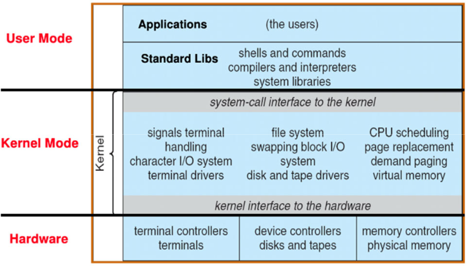

# 1. What is an Operating System?

There is no universally accepted definition. 'Everything a vendor ships when you order an operating system' is good approximation, but it varies wildly. We can define os as:

`Special layer of software that provides application software access to hardware resources`.

OS procides clean, easy-to-use abstractions of physical resources like:
- infinite memory (looks like)
- higher level objects like files, users, messages
- masking limitations, virtualization

    

Also, os manage protection, isolation, and sharing of resources (along processes)

    

And it works as 'glue' of common services:
- storage, window system, networking
- sharing, authorization
- look and feel

    

# 2. Four Fundamental OS Concepts

- Thread
- Address space
- Process
- Dual mode operation & Protection

## 2.1. Thread

Thread is a single unique execution context. It fully describes program state using program counter, registers, execution flags, stack, memory state. When it is resigent in the processor registers, it is said 'a thread is executing on a processor'. When it's not, is said 'thread is suspended', and it's saved in chunk of memory called `Thread Control Block(TCB)`.

    

If we assume a single processor, we can provide the illusion of multiple processors using multiplex in time. In this way, we can say threads are virtual cores.

    

## 2.2. Address Space

Address Space is a set of memory addresses accessible to program. When read/write to an address, os might read/wirte to an address, ignore writes, do I/O operation, raise exception, etc. Since sharing all memory spaces along all programs does not protect anything, we need to limit the scope of that threads can do.

### 2.2.1. Simple Protection: Base and Bound

    

We can add on-the-fly addresses translation, instead of address translation when program loaded. But this one has `fragmentation problem`. When program exits, yellow area is fragmented unless dealt really well.

### 2.2.2. Address Space Translation: Paged Virtual Address Space

This is generallization of previous idea.  Program operates in an address space that is distinct from
the physical memory space of the machine.

    

We break the entire virtual address space into equal size chunks(i.e. pages). Then, hardware will translates address using a page table.

    

## 2.3. Process

Process is an execution environment with Restricted Rights. That is, it has Protected Address Space and One or more Threads. This way, processes are protected from each other, and OS is protected from them.

## 2.4. Dual mode operation & Protection

Hardware provides at least two modes, `Kernel Mode` and `User Mode`. Only the system, that runs in Kernel Mode has the ability to access certain resources. For example, changin the page table pointer, disabling interrupts, interacting directly with hardware, writing to kernel memory are prohibited when running in user mode. Combined with translation, this isolates programs from each other and the OS from programs. 

    

There are 3 types of User->Kernel Mode transfer:

- `Syscall`
  - Process requests a system service like `exit`
- `Interrupt`
  - External asynchronous event triggers context switch. e.g. Timer, I/O
- `Trap or Exception`
  - Internal synchronous event in process triggers context switch. e.g. segfault, divide by zero

So, how we run many programs? Kernel represents each process as a `Process Control Block(PCB)`:
- status (running, ready, blocked, ...)
- register state
- PID, User, Executable, Priority, ...
- Execution time, ...
- Memory space, translation, ...

And Kernel Scheduler maintains a data structure containing the PCBs and selects the next one to run.

    

