- Basic Schedulings
- Linux O(1) Scheduler
- Realtime Scheduling
- Stride Scheduling
- CFS
- deadlock

<p align="center">
    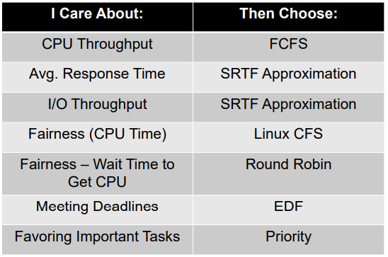
</p>

# 1. Scheduling Concept

Scheduling is deciding which threads are given access to resources from moment to moment. We mainly think in terms of CPU time, but could also think about access to resources like network BW or disk access.

<p align="center">
    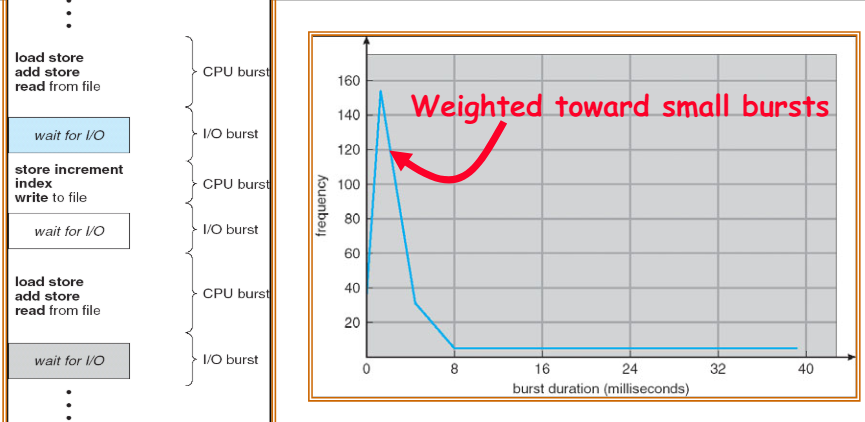
</p>

Program typically uses the CPU for some period of time, then does I/O, then uses CPU again. Most of them has short burst duration. We need to decide which job to give to the CPU, while we could force executing thread to give up CPU for timeslicing.

## 1.1. requirements

### 1.1.1. Minimize Response Time

Have to minimize elapsed time to do an operation, so that user can see the result of committed job.

### 1.1.2. Maximize Throughput

Have to maximize operations per second. (trade-off with minimize response time)

### 1.1.3. Fairness

Have to share CPU among users in some equitable way.


## 1.2. FCFS (First Come, First Served)

Suppose process P1 with burst time 24, P2 with 3, P3 with 3.

<p align="center">
    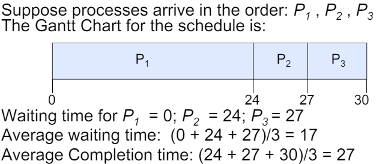
    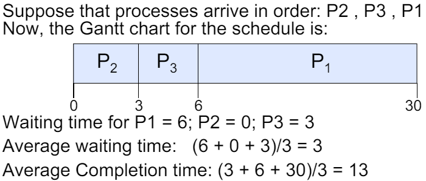
</p>

This seems simple, and best for cache coherence&reuse. But short process can stuck behind long process (`Convoy effect`). i.e. potentially bad for short jobs.

<p align="center">
    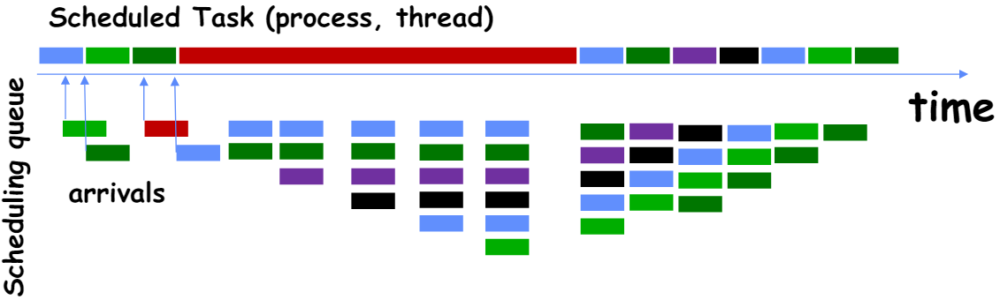
</p>

## 1.3. RR

Round Robin Scheme does `preemption` for each process getting CPU time. Usually each process gets 10-100 ms of CPU time. After quantum expires, the process is preempted and added to the end of the ready queue. The time unit each process gets must be large with respect to context switch, otherwise overhead is too high.

Suppose:
|Process|Burst Time|
|--|--|
|P1|53|
|P2|8|
|P3|68|
|P4|24|

<p align="center">
    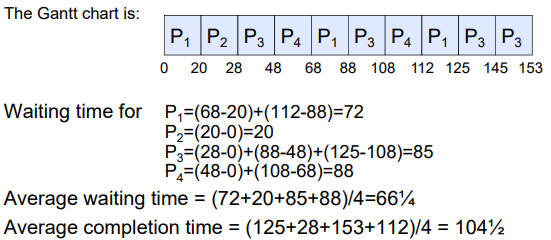
</p>

RR is better for short jobs, and is fair. But context-switching time adds up for long jobs. Also, it's not always better than FCFS. In the case below, we can see that Best FCFS is better than RR:

<p align="center">
    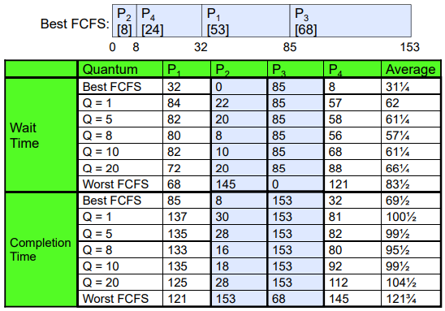
</p>


## 1.4. Priority Scheduling

<p align="center">
    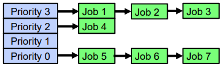
</p>

We set priority for each job, and each priority has queue. We always execute highest-priority runable jobs to completion, and each queue can be processed in RR with some time-quantum. This is `Strict Priority Scheduling`.

But then, (`Starvation`) lower priority jobs could not get to run because there are higher priority jobs cotinuously coming. Also, (`Priority Inversion`) if low priority task has lock, and higher priority job needs it, a `deadlock` happens.

We could twist the algorithm to solve the problem. `Dynamic priorities` is adjusting the priority up or down based on heuristics about interactivity, locking, burst behavior, etc.

### 1.4.1. What if we knew the future?: SRTF

What if we knew the future? What if we knew entire job's execution time, remaining time?

- Shortest Job First (`SJF`):
  - Run whatever job has least amount of computation to do
  - Sometimes called "Shortest Time to Completion First" (STCF)
- Shortest Remaining Time First (`SRTF`):
  - Preemptive version of SJF: if job arrives and has a shorter time to completion than the remaining time on the current job, immediately preempt CPU
  - Sometimes called "Shortest Remaining Time to Completion First" (SRTCF)
  - (`Optimal`) Optimal for average response time
  - (`Starvation`) Large jobs could stuck behind many small jobs
  - (`Impossible`) Cannot predict future

=> Idea is to get short jobs out of the system. (Better response time)

Example: `RR vs SRTF`

```
A, B: CPU bound, run for week
C: I/O bound, 1ms CPU, 9ms I/O
```

<p align="center">
    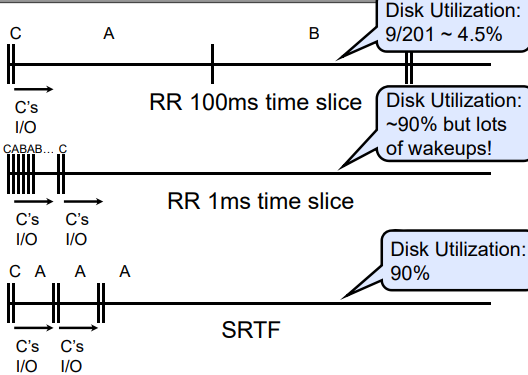
</p>

## 1.5. Multi-Level Feedback Scheduling

<p align="center">
    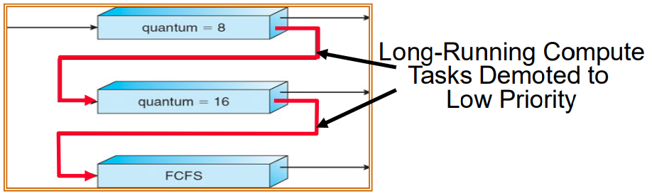
</p>

Approximation of SRTF. First, job starts in highest priority queue. If timeout expires, drop that job's priority, else, push up job's priority. This way, long-running compute tasks will be demoted to low priority.

Also, each queue has its own scheduling algorithm. e.g. for `foreground`(high priority) jobs, RR, background jobs, FCFS.

Scheduling must be done between the queues:
- Fixed priority scheduling:
  - serve all from highest priority, then next priority, etc.
- Time slice:
  - each queue gets a certain amount of CPU time
  - e.g., 70% to highest, 20% next, 10% lowest

But this can be hacked using simple idea. Putting in a bunch of meaningless I/O(printf) will keep job's priority high.

## 1.6. Lottery Scheduling

- Give each job some number of lottery tickets
  - To approximate SRTF, short running jobs get more, long running jobs get fewer
  - To avoid starvation, every job gets at least one ticket (everyone makes progress)
- On each time slice, randomly pick a winning ticket
- On average, CPU time is proportional to number of tickets given to each job

# 2. Real-world Scheduling

## 2.1. Linux O(1) Scheduler 

40 for “user tasks” (set by “nice”), 100 for “Realtime/Kernel”

- Two separate priority queues: “active” and “expired”
  - All tasks in the active queue use up their timeslices and get placed on the expired queue, after which queues swapped
- Timeslice depends on priority – linearly mapped onto timeslice range
  - Like a multi-level queue (one queue per priority) with different timeslice at each level
  - Execution split into “Timeslice Granularity” chunks – round robin through priority

=> no one use this now(hard to understand why something done that way)

## 2.2. Realtime Scheduling : Predictability of Performance

Real-time systems are systems that carry real-time tasks. These tasks need to be performed immediately with a certain degree of urgency. In particular, these tasks are related to control of certain events (or) reacting to them. Real-time tasks can be classified as hard real-time tasks and soft real-time tasks. 

A `hard real-time` task must be performed at a specified time which could otherwise lead to huge losses. (-> Earliest Deadline First (`EDF`), Least Laxity First (`LLF`), Rate-Monitonic Scheduling (`RMS`), Deadline Monotonic Scheduling (`DM`)) In `soft real-time` tasks, a specified deadline can be missed. This is because the task can be rescheduled (or) can be completed after the specified time.

If a preemptive scheduler is used, the real-time task needs to wait until its corresponding tasks time slice completes. In the case of a non-preemptive scheduler, even if the highest priority is allocated to the task, it needs to wait until the completion of the current task. This task can be slow (or) of the lower priority and can lead to a longer wait. 

For tasks periodic with period $P_i$, deadline $D_i$ and computation $C_i$ for each task $i$, EDF works well with condition:

$$\displaystyle\sum_{i=1}^{n}\frac{C_i}{D_i}\leq 1,  \forall t$$

EDF schedules the active task with the colsest absolute deadline:
<p align="center">
    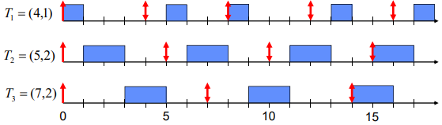
</p>

## 2.3. Starvation

The policies we’ve studied so far:
- Always prefer to give the CPU to a prioritized job
- Non-prioritized jobs may never get to run

=> Instead, we can share the CPU proportionally
- Give each job a share of the CPU according to its priority
- Low-priority jobs get to run less often
- But all jobs can at least make progress (no starvation)


## 2.4. Fairness

### 2.4.1. Stride Scheduling

Each job has it's own `stride` number and `pass` value. For example, A has stride&pass value as 100, B has 200, and C has 40. Then, do lottery scheduling by giving tickets proportional to $bigW/stride$. For example, if $W=10,000$, number of tickets for A is 100, B is 50, C is 250. C has the largest probability to be executed. And then, scheduler picks the job, runs it, and add its stride to its pass value.

### 2.4.2. CFS: Linux Completely Fair Scheduler

Goal is to make each process get an equal share of CPU. To do so, it tracks CPU time per thread and schedule threads to match up average rate of execution.

<p align="center">
    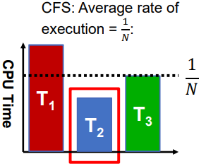
</p>

CPU time can be weighted for prioritizing:

<p align="center">
    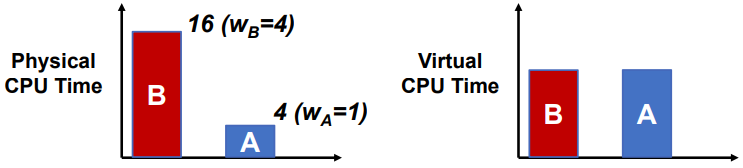
</p>


# 3. Deadlock

4 requirements for deadlock:

- Mutual exclusion
  - Only one thread at a time can use a resource.
- Hold and wait
  - Thread holding at least one resource is waiting to acquire additional resources held by other threads
- No preemption
  - Resources are released only voluntarily by the thread holding the resource, after thread is finished with it
- Circular wait

Example:

```
Thread Types T1, T2, ...
Resource Types R1, R2, ... -> 'dot' is an instance of the resource
    |- e.g. CPU cycles, memory space, I/O devices, etc.

request edge: Ti -> Rj
assignment edge: Rj -> Ti
```

<p align="center">
    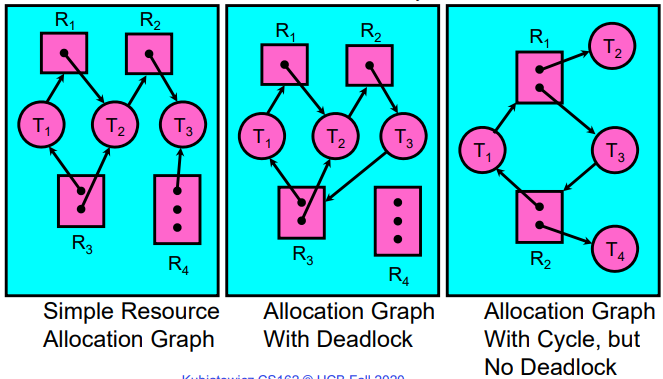
</p>


## 3.1. detection algorithm

```
[FreeResources]: Current free resources each type
[RequestX]: Current requests from thread X
[AllocX]: Current resources held by thread X

[Avail] = [FreeResources]
Add all nodes(Xs) to UNFINISHED
do {
    done = true
    Foreach X in UNFINISHED {
        if ([RequestX] <= [Avail]) { // X can finish
            remove X from UNFINISHED
            [Avail] = [Avail] + [AllocX] // giveup X's resources
            done = false
        }
    }
} until(done)

if (UNFINISHED) {
    it's deadlocked
}
```

## 3.2. Preventing Deadlock

Basic idea is to remove at least 1 of the deadlock requirements. 
- Don't allow waiting (inefficient since have to keep retrying)
- Make all threads request everything they’ll need at the beginning.
- Force all threads to request resources in a particular order preventing any cyclic use of resources.

### 3.2.1. Banker's Algorithm

The Banker's Algorithm is a resource allocation and deadlock avoidance algorithm that tests for safety by simulating the allocation for the predetermined maximum possible amounts of all resources, then makes an “s-state” check to test for possible activities, before deciding whether allocation should be allowed to continue.

