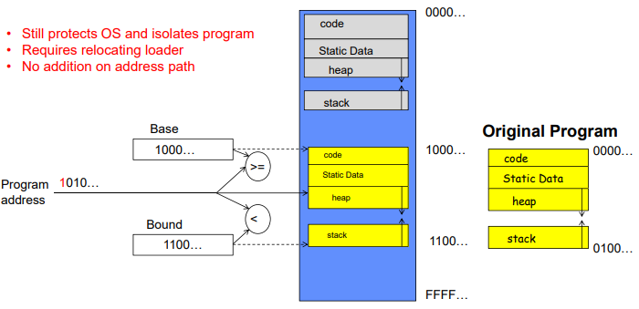
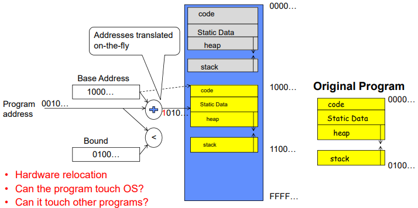
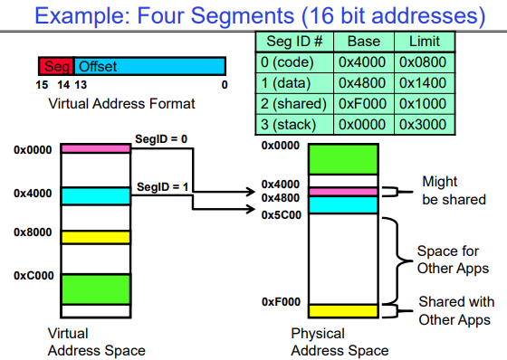
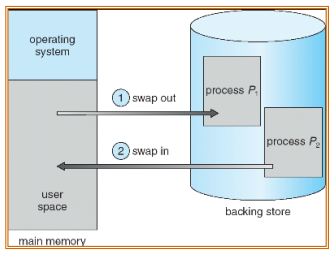
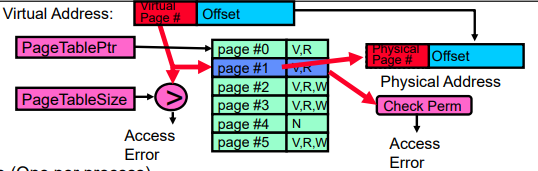
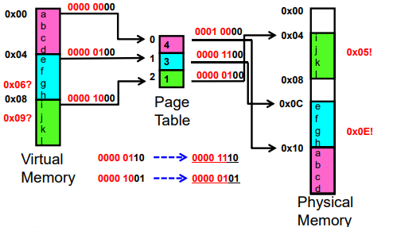
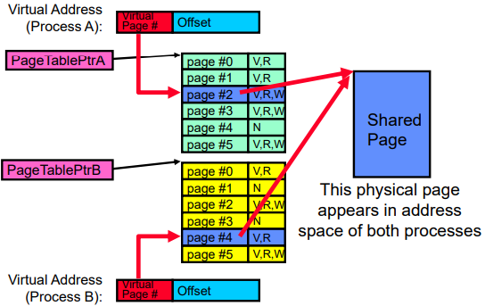

- Page Table

# 1. Address Translation

## 1.1. Important Aspects

- Protection:
  - Prevent access to private memory of other processes
    - Different pages of memory can be given special behavior (Read Only, Invisible to user programs, etc).
    - Kernel data protected from User programs
    - Programs protected from themselves
- Translation:
  - Ability to translate accesses from one address space (virtual) to a different one
(physical)
  - When translation exists, processor uses virtual addresses, physical memory
uses physical addresses
  - Side effects:
    - Can be used to avoid overlap
    - Can be used to give uniform view of memory to programs
- Controlled overlap:
  - Separate state of threads should not collide in physical memory. Obviously, unexpected overlap causes chaos!
  - Conversely, would like the ability to overlap when desired (for communication)

\*  Can we protect programs from each other without translation? 

=> Yes: Base and Bound!

## 1.2. Base and Bound (B&B)

### 1.2.1. B&B (No Translation)

This needs to load program with address changed.

    

### 1.2.2. B&B (With Translation)

From now, MMU (Memory Management Unit) involves.

    

But these problems remain:

- Fragmentation problem over time
  - Not every process is same size => memory becomes fragmented over time
- Missing support for sparse address space
  - Would like to have multiple chunks/program (Code, Data, Stack, Heap, etc)
- Hard to do inter-process sharing
  - Want to share code segments when possible
  - Want to share memory between processes
  - Helped by providing multiple segments per process

### 1.2.3. Segmentation (B&B, Translation, Multi-Segment)

Each segment is given region of contiguous memory. These have base and limit. Segment table is in CPU (MMU). And different for each process.

    

- Segment map resides in processor
  - Segment number mapped into base/limit pair
  - Base added to offset to generate physical address
  - Error check catches offset out of range
- As many chunks of physical memory as entries
  - Segment addressed by portion of virtual address
  - However, could be included in instruction instead:
    - x86 Example: mov [es:bx],ax.
- What is “V/N” (valid / not valid)?
  - Can mark segments as invalid; requires check as well

\* OBSERVATIONS

- Translation on every instruction fetch, load or store
- Virtual address space has holes
  - Segmentation efficient for sparse address spaces
- When it is OK to address outside valid range?
  - This is how the stack (and heap?) allowed to grow
  - For instance, stack takes fault, system automatically increases size of stack
- Need protection mode in segment table
  - For example, code segment would be read-only
  - Data and stack would be read-write (stores allowed)
- What must be saved/restored on context switch?
  - Segment table stored in CPU, not in memory (small)
  - Might store all of processes memory onto disk when switched (called “**swapping**”)

    

\* PROBLEMS

- Must fit variable-sized chunks into physical memory
- May move processes multiple times to fit everything
- Limited options for swapping to disk
- **Fragmentation**: wasted space
  - External: free gaps between allocated chunks
  - Internal: don’t need all memory within allocated chunks
  - Solution => Allocate physical memory in fixed size chunks (“pages”)

## 1.2.4. Paging (Fixed sized B&B)

    

- Page Table (One per process)
  - **Resides in physical memory**
  - Contains physical page and permission for each virtual page (e.g. Valid bits, Read, Write, etc)
- Virtual address mapping
  - Offset from Virtual address copied to Physical Address
    - Example: 10 bit offset => 1024-byte pages
  - Virtual page # is all remaining bits
    - Example for 32-bits: 32-10 = 22 bits, i.e. 4 million entries
    - Physical page # copied from table into physical address
  - Check Page Table bounds and permissions

    

\* Page sharing?

    

Use cases:
- The “kernel region” of every process has the same page table entries
  - The process cannot access it at user level
  - But on U->K switch, kernel code can access it AS WELL AS the region for THIS user
    - What does the kernel need to do to access other user processes?
- Different processes running same binary!
  - Execute-only, but do not need to duplicate code segments
- User-level system libraries (execute only)
- Shared-memory segments between different processes
  - Can actually share objects directly between processes
    - Must map page into same place in address space!
- This is a limited form of the sharing that threads have within a single process
