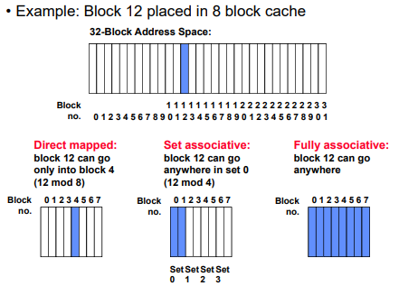
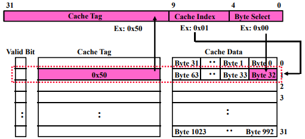
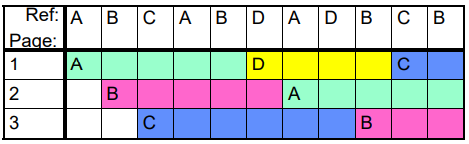

- Page Table

# 1. Address Translation

    

## 1.1. Important Aspects

- Protection:
  - Prevent access to private memory of other processes
    - Different pages of memory can be given special behavior (Read Only, Invisible to user programs, etc).
    - Kernel data protected from User programs
    - Programs protected from themselves
- Translation:
  - Ability to translate accesses from one address space (virtual) to a different one
(physical)
  - When translation exists, processor uses virtual addresses, physical memory
uses physical addresses
  - Side effects:
    - Can be used to avoid overlap
    - Can be used to give uniform view of memory to programs
- Controlled overlap:
  - Separate state of threads should not collide in physical memory. Obviously, unexpected overlap causes chaos!
  - Conversely, would like the ability to overlap when desired (for communication)

\*  Can we protect programs from each other without translation? 

=> Yes: Base and Bound!

## 1.2. Base and Bound (B&B)

### 1.2.1. B&B (No Translation)

This needs to load program with address changed.

    

### 1.2.2. B&B (With Translation)

From now, MMU (Memory Management Unit) involves.

    

But these problems remain:

- Fragmentation problem over time
  - Not every process is same size => memory becomes fragmented over time
- Missing support for sparse address space
  - Would like to have multiple chunks/program (Code, Data, Stack, Heap, etc)
- Hard to do inter-process sharing
  - Want to share code segments when possible
  - Want to share memory between processes
  - Helped by providing multiple segments per process

### 1.2.3. Segmentation (B&B, Translation, Multi-Segment)

Each segment is given region of contiguous memory. These have base and limit. Segment table is in CPU (MMU). And different for each process.

    

- Segment map resides in processor
  - Segment number mapped into base/limit pair
  - Base added to offset to generate physical address
  - Error check catches offset out of range
- As many chunks of physical memory as entries
  - Segment addressed by portion of virtual address
  - However, could be included in instruction instead:
    - x86 Example: mov [es:bx],ax.
- What is “V/N” (valid / not valid)?
  - Can mark segments as invalid; requires check as well

\* **OBSERVATIONS**

- Translation on every instruction fetch, load or store
- Virtual address space has holes
  - Segmentation efficient for sparse address spaces
- When it is OK to address outside valid range?
  - This is how the stack (and heap?) allowed to grow
  - For instance, stack takes fault, system automatically increases size of stack
- Need protection mode in segment table
  - For example, code segment would be read-only
  - Data and stack would be read-write (stores allowed)
- What must be saved/restored on context switch?
  - Segment table stored in CPU, not in memory (small)
  - Might store all of processes memory onto disk when switched (called “**swapping**”)

    

\* **PROBLEMS**

- Must fit variable-sized chunks into physical memory
- May move processes multiple times to fit everything
- Limited options for swapping to disk
- **Fragmentation**: wasted space
  - External: free gaps between allocated chunks
  - Internal: don’t need all memory within allocated chunks
  - Solution => Allocate physical memory in fixed size chunks (“pages”)

### 1.2.4. Paging (Fixed sized B&B)

    

- Page Table (One per process)
  - **Resides in physical memory**
  - Contains physical page and permission for each virtual page (e.g. Valid bits, Read, Write, etc)
- Virtual address mapping
  - Offset from Virtual address copied to Physical Address
    - Example: 10 bit offset => 1024-byte pages
  - Virtual page # is all remaining bits
    - Example for 32-bits: 32-10 = 22 bits, i.e. 4 million entries
    - Physical page # copied from table into physical address
  - Check Page Table bounds and permissions

    

\* **Page sharing?**

    

Use cases:
- The “kernel region” of every process has the same page table entries
  - The process cannot access it at user level
  - But on U->K switch, kernel code can access it AS WELL AS the region for THIS user
    - What does the kernel need to do to access other user processes?
- Different processes running same binary!
  - Execute-only, but do not need to duplicate code segments
- User-level system libraries (execute only)
- Shared-memory segments between different processes
  - Can actually share objects directly between processes
    - Must map page into same place in address space!
- This is a limited form of the sharing that threads have within a single process

\* **OBSERVATION**

- What needs to be switched on a context switch?
  - Page table pointer and limit
- What provides protection here?
  - Translation (per process) and dual-mode!
  - Can't let process alter its own page table!

\* **PROBLEMS**

- Pros
  - Simple memory allocation
  - Easy to share
- Con: What if address space is sparse?
  - E.g., on UNIX, code starts at 0, stack starts at (2^31-1)
- Con: What if table really big?
  - Not all pages used all the time => would be nice to have working set of page table in memory
  - With 4KB(typical) page size, 2^(32-12) x 4bytes each = 2^20 x 4bytes each = 4MB. (for x64, 36 exa bytes)

## 1.3. Multi Level Translation

### 1.3.1. Multi Level Paging

    

If page fault for page table arise, it's slow, but by using cache, it's no big deal.

---
\* **What's PTE anyways?**

- What is in a Page Table Entry (or PTE)
  - Pointer to next-level page table or to actual page
  - Permission bits: valid, read-only, read-write, write-only
- Example: Intel x86 architecture PTE:
  - Address same format previous slide (10, 10, 12-bit offset)
  - Intermediate page tables called “Directories”

    

- P: Present (same as “valid” bit in other architectures)
- W: Writeable
- U: User accessible
- PWT: Page write transparent: external cache write-through
- PCD: Page cache disabled (page cannot be cached)
- A: Accessed: page has been accessed recently
- D: Dirty (PTE only): page has been modified recently
- PS: Page Size: PS=1=>4MB page (directory only). Bottom 22 bits of virtual address serve as offset
---
- How do we use the PTE?
  - Invalid PTE can imply different things:
    - Region of address space is actually invalid or
    - Page/directory is just somewhere else than memory
  - Validity checked first
    - OS can use other (say) 31 bits for location info
- Usage Example: **Demand Paging**
  - Keep only active pages in memory
  - Place others on disk and mark their PTEs invalid
- Usage Example: **Copy on Write**
  - UNIX fork gives copy of parent address space to child
    - Address spaces disconnected after child created
  - How to do this cheaply?
    - Make copy of parent's page tables (point at same memory)
    - Mark entries in both sets of page tables as read-only
    - Page fault on write creates two copies
- Usage Example: **Zero Fill On Demand**
  - New data pages must carry no information (say be zeroed)
  - Mark PTEs as invalid; page fault on use gets zeroed page
  - Often, OS creates zeroed pages in background

### 1.3.2. Segments + Pages

Use lowest level to page table, and higher levels to segment table.

    

- Pros:
  - Only need to allocate as many page table entries as we need for application
    - In other wards, sparse address spaces are easy
  - Easy memory allocation
  - Easy Sharing
    - Share at segment or page level (need additional reference counting)
- Cons:
  - One pointer per page (typically 4K - 16K pages today)
  - Page tables need to be contiguous
    - However, the 10b-10b-12b configuration keeps tables to exactly one page in size
  - Two (or more, if >2 levels) lookups per reference
    - Seems very expensive!

\* **We don't use this in modern system.**

- **Paging is sufficient** for memory translation: Modern systems rely heavily on paging for virtual memory management. Paging divides memory into fixed-size pages and uses page tables to translate virtual addresses to physical addresses. This approach provides fine-grained control over memory access, isolation between processes, and efficient use of physical memory.
- Segmentation adds complexity: Using both segmentation and paging together would introduce additional levels of complexity in address translation, which is unnecessary given that paging alone meets the needs of modern systems.

    

### 1.3.3. Inverted Page Table

For just tree-structured forward page tables..
- Size of page table is at least as large as amount of virtual memory allocated to processes
- Physical memory may be much less
  - Much of process space may be out on disk or not in use

So we can use hash table. Size is independent of virtual address space.

    

- Cons:
  - Complexity of managing hash chains: Often in hardware!
  - Poor cache locality of page table

# 2. Caching

## 2.1. TLB

We record recent 'Virtual Page # to Physical Frame # translation' to TLB. If present, have the physical address without reading any of the page tables, which is really fast.
Even if the translation involved multiple levels, this caches the 'end-to-end result'. But we need to make sure about consistency.
On a TLB miss, the page tables may be cached, so only go to memory when both miss.

### 2.1.1. Caching Schemes

    

#### Direct Mapped cache

Each virtual page number maps to exactly one specific TLB entry. 
The uppermost (32 - N) bits are always the Cache Tag. 
The lowest M bits are the Byte Select. (Block Size = 2^M)

Below is an example of 1KB direct mapped cache with 32B blocks.
Cache Index choose entry, byte select selects byte. tag checked to verify block.

    

- Pros:
  - Very simple and fast.
  - Low hardware cost.
- Cons:
  - Collisions occur frequently (when two virtual pages map to the same TLB entry), causing frequent replacements and reducing efficiency.

#### Set Associative Cache

A compromise between direct-mapped and fully associative. The TLB is divided into sets, and each set contains a fixed number of entries (e.g., 2-way, 4-way associative).
A virtual page number maps to exactly one set, but within that set, it can occupy any entry. So we need to search each set with entry.

Below is an example of 2-way associative cache with 32B blocks, 16 entries. 
Data is selected based on the tag result.

    

- Pros:
  - Balances cost and performance.
  - Reduces collisions compared to direct-mapped TLBs.
- Cons:
  - Still has some collisions, though fewer than direct-mapped.

#### Fully Associative Cache

Any virtual page number can be stored in any entry of the TLB.
During a lookup, the TLB is searched for a match for the virtual page number. If found, it returns the corresponding frame number.

Below is an example of fully associative cache with 32B blocks.

    

- Pros:
  - Maximizes TLB hit rate since there are no restrictions on where a mapping can be placed.
- Cons:
  - Requires complex and slower hardware for associative search.
  - Expensive to implement for large TLBs.

## 2.2. Cache

TLB saves PTEs. Cache here stands for store for saving actual data or instructions from main memory.

### 2.2.1. Physically-Indexed vs Virtually Indexed

#### Physically-Indexed

This is what we were talking about. Page Table holds physical addresses.

    

- Pros:
  - No aliasing issues: Since the physical address is unique, there is no risk of cache inconsistencies caused by multiple virtual addresses mapping to the same physical memory.
  - Simpler to implement and maintain cache coherence.
- Cons:
  - Slower lookup: Accessing the cache requires waiting for the virtual-to-physical address translation step via the TLB.

#### Virtually-Indexed

    

- Pros:
  - Faster lookup: Since the cache index is derived from the virtual address, the TLB translation step can be skipped for indexing.
- Cons:
  - Alias problem (Synonym problem): Different virtual addresses may map to the same physical address (e.g., shared memory regions), causing data inconsistency or redundancy in the cache.
  - To handle this, cache coherence mechanisms or additional checks are needed, which add complexity. (or just flush cache in context switch, which would make system slow cold start)

\* Thrashing: continuous conflicts between accesses, wasting time for I/O.

### 2.2.2. Overlapping TLB & Cache Accesse

For physically indexed cache, it's bad that TLB is in critical path, might be slow for PTE miss and asks to page table(on main memory).

To speed up the system, we can do cache searching while accessing TLB.
This works because offset is available early. i.e. The lower bits (page offset) are identical in both the virtual and physical addresses.
Only the tag comparison depends on the TLB result.

    

### 2.2.3. Sources of Cache Misses

- Compulsory (cold start or process migration, first reference): first access to a block
  - “Cold” fact of life: not a whole lot you can do about it
  - Note: If you are going to run “billions” of instruction, Compulsory Misses are insignificant
- Capacity:
  - Cache cannot contain all blocks access by the program
  - Solution: increase cache size
- Conflict (collision):
  - Multiple memory locations mapped to the same cache location. (don't exist in virtual memory since fully-associative cache - since it's through page table)
  - Solution 1: increase cache size
  - Solution 2: increase associativity
- Coherence (Invalidation): other process (e.g., I/O) updates memory

## 2.3. Putting Everything together

    

1. Application Requests Data at a Virtual Address

   - The application provides a virtual address (VA). This address must be translated into a physical address (PA) before accessing memory.

2. Check the TLB for the Virtual Page Number (VPN)

   - The TLB (Translation Lookaside Buffer) is checked using the VPN.
   - The VPN is split into:
     - High bits: For the first-level page table.
     - Middle bits: For the second-level page table.
   - If the VPN is found in the TLB (a TLB hit), the corresponding physical frame number (PFN) is immediately available, and you skip to step 5.

3. TLB Miss: Access the Multi-Level Page Table

   - If the VPN is not in the TLB, the system consults the page table stored in main memory:
     - Use the page table pointer (PTP) (a physical address provided by the operating system) to locate the first-level page table.
     - Use the highest bits of the VPN to find the entry in the first-level page table. This entry points to the second-level page table.
     - Use the middle bits of the VPN to find the entry in the second-level page table. This entry provides the PFN.

4. Update the TLB

   - Once the PFN is found, the mapping (VPN → PFN) is added to the TLB for future lookups.

5. Use the Physical Address to Access the Cache

   - The physical address is now formed by combining:
   - PFN (from the TLB or page table).
     - Page offset (lower bits of the virtual address, unchanged during translation).
   - The cache index is derived from the page offset and some bits of the PFN.
   - The cache is checked:
     - If the data is in the cache (a cache hit), the requested data is returned immediately.
     - If it's not in the cache (a cache miss), the system fetches the data from main memory and updates the cache.

# 3. Demand Paging

A **page fault** occurs when a program tries to access a page in memory, but that page is not currently loaded in physical memory (RAM). 
This triggers the operating system to handle the situation by either:
- Bringing the required page into memory from secondary storage (e.g., disk).
- Terminating the program if the access is invalid. (accessing a protected area - segmentation fault)

90-10 rule says that programs spend 90% of their time in 10% of their code. It would be wasteful to require all of user's code to be in memory.
**Demand Paging** is a memory management strategy where pages are loaded into physical memory only when they are needed, rather than preloading all pages of a program into memory.

This approach reduces memory usage and improves efficiency, as only the active portions of a program are kept in memory.

    

If the Present/Valid bit in the page table entry is not set, the MMU signals a page fault exception to the operating system.
The CPU interrupts normal program execution and jumps to the page fault handler, a part of the operating system's kernel. (context switch occurs)

The page fault handler analyzes the faulting virtual address and the error code provided by the MMU.
If it's not valid, terminate the process (segmentation fault). If it's valid but not in memory, the handler checks if there is a free frame available in physical memory.
If no free frame is available, page replacement occurs(e.g., LRU, FIFO). The victim page is written back to disk (if dirty) and marked as "not present" in the page table.

Then reads the required page from disk (swap space) or file system into a free or newly evicted frame.
Also, it updates page table Present/Valid bit, updates the PFN (physical frame number) field to point to the frame in memory.
Once the missing page is loaded into memory, The page fault handler resumes the program at the instruction that caused the fault. (gets back to ready queue)

    

## 3.1. Replacement Algorithms

- FIFO (First In, First Out)
  - Throw out oldest page. Be fair - let every page live in memory for same amount of time.
  - Bad - throws out heavily used pages instead of infrequently used
  - example:

    

- RANDOM:
  - Pick random page for every replacement
  - Typical solution for TLB's. Simple hardware
  - Pretty unpredictable - makes it hard to make real-time guarantees

- MIN (Minimum):
  - Replace page that won't be used for the longest time
  - Great (provably optimal), but can't really know future…
  - But past is a good predictor of the future
  - example: (choose if we know the future! - LRU also same in this case)

    

- LRU (Least Recently Used):
  - Replace page that hasn't been used for the longest time
  - Programs have locality, so if something not used for a while, likely to be used in the near future.
  - Seems like LRU should be a good approximation to MIN.
  - But this needs large store(maybe by accessing DRAM). So in practice, we approximate LRU
  - example: (all reference is a page fault - FIFO same in this case)

    

- Clock Algorithm (Approximating LRU) (not recently used)
  - Each page is given a "use bit". When a page is accessed, set to 1. Upon sweeping (happens when page fault) check if a page's bit is set to 1. If yes, set to zero, if no, then evict it.
  - Will always find a page or loop forever? => When we are trying to find a new page, all the other things are suspended. Even if all use bits set, will eventually loop all the way around. Like FIFO.

    

- Nth chance version of clock algorithm
  - When use bit is 0, does not evict immediately. Instead, increase counter. if count == N, evict that page.
  - Means that clock hand has to sweep by N times without page being used before page is replaced.

- Second-Chance List Algorithm
  - Split memory in two: Active list (RW), SC list (Invalid)
  - Access pages in Active list at full speed
  - Otherwise, Page Fault
    - Always move overflow page from end of Active list to front of Second-chance list(SC) and mark invalid
    - Desired Page On SC List: move to front of Active list, mark RW
    - Not on SC list: page in to front of Active list, mark RW; page out LRU victim at end of SC list

    

- Free List
  - Keep set of free pages ready for use in demand paging
    - Freelist filled in background by Clock algorithm or other technique (“Pageout demon”)
    - Dirty pages start copying back to disk when enter list
  - Like VAX second-chance list
    - If page needed before reused, just return to active set
  - Advantage: faster for page fault
    - Can always use page (or pages) immediately on fault

    

## 3.2. Allocating to processes

**Reverse Page Mapping** is a mechanism to track which processes are using a specific physical memory page.
This helps manage shared pages (e.g., shared libraries or memory-mapped files), 
ensures accurate updates to page tables for all processes when a page is replaced, and
prevents premature eviction of shared pages needed by multiple processes.

For **Global Replacement**(used most), any page frame in the system can be replaced, regardless of which process owns it.
A process selects replacement frame from set of all frames, so one process can take a frame from another.
Since a single page might be part of any process, reverse mapping helps determine all the processes that might be impacted if a page is replaced.

For **Local Replacement**, a process can replace only pages in its own allocated set of frames.
Even in local replacement, processes may share pages (e.g., shared libraries or memory-mapped files). Reverse page mapping ensures that the system knows all the processes that depend on a specific page, so it can properly update page tables or prevent premature replacement of shared pages.

### 3.2.1. Allocation Strategies

- Equal allocation (Fixed Scheme):
  - Every process gets same amount of memory
  - Example: 100 frames, 5 processes => process gets 20 frames
  - Simple, but ignores process-specific needs
- Proportional allocation (Fixed Scheme)
  - Allocate according to the size of process
  - Better than equal, but still static and doesn't adapt to runtime changes in memory demands.
- Priority Allocation:
  - Proportional scheme using priorities rather than size
    - Same type of computation as previous scheme
  - **Page-Fault Frequency (PFF) Based Allocation**: Dynamically adjusts the number of frames based on the process's page fault frequency.
    - Possible behavior: If process generates a page fault, select for replacement a frame from a process with lower priority number

    

