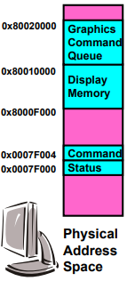
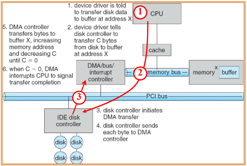
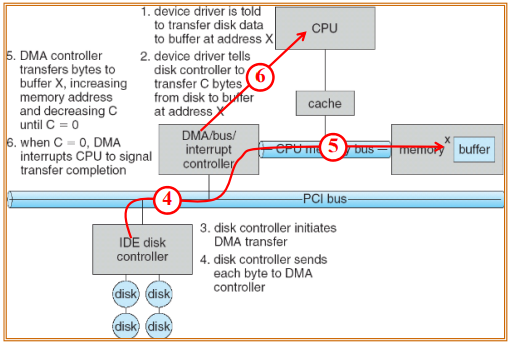
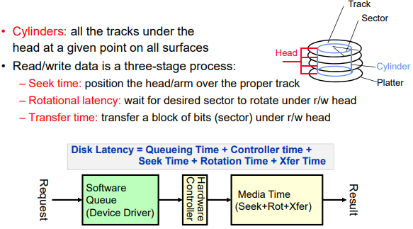
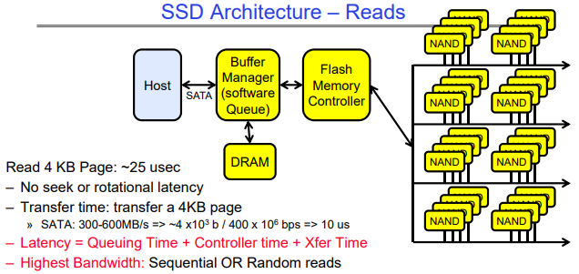

# 1. I/O

    
    

## 1.1. CPU and Controller

### 1.1.1. PMIO, MMIO

    
    

- CPU interacts with a Controller
  - Contains a set of registers that can be read and written
  - May contain memory for request queues, etc.
- Processor accesses registers in two ways:
  - **Port-Mapped I/O** (PMIO): in/out instructions
    - Often used in simpler or legacy systems. Speaker in pintos
    - CPU uses special I/O instructions (IN, OUT) to interact with the device controller through dedicated I/O ports.These ports are not part of the main memory address space but exist in a separate I/O address space. The request is routed to the appropriate device controller via the system bus.
    - Example from the Intel architecture: out 0x21,AL
  - **Memory-mapped I/O** (MMIO): load/store instructions
    - Common in modern systems and complex devices, like GPUs and high-speed network cards.
    - Registers/memory appear in physical address space. CPU reads from or writes to specific memory addresses that are mapped to the device registers. The memory controller interprets these requests as device register accesses and forwards them to the appropriate device via the system bus. The device controller writes back data to the mapped memory address, which the CPU reads during subsequent instructions.
    - I/O accomplished with load and store instructions
    - Safe by address translation

### 1.1.2. PIO, DMA

- **Programmed I/O (PIO)**:
  - In PIO, the CPU directly manages the data transfer between memory and the device. The CPU explicitly reads data from or writes data to the device controller, one operation at a time.
  - Flow:
    - Device Signals Readiness (Polling or Interrupt):
      - The device signals that it is ready to send/receive data:
        - Polling: The CPU continuously checks (polls) a status register on the device for readiness.
        - Interrupts: The device generates an interrupt when ready, reducing CPU idle time.
    - CPU Initiates Data Transfer:
      - For Input:
        - The CPU sends a read command to the device.
        - The device controller places the data on the data bus.
        - The CPU reads the data from the bus and stores it in a register or memory.
      - For Output:
        - The CPU writes data to a specific memory/register associated with the device.
        - The device controller retrieves this data from the bus.
    - CPU Repeats Process Until Done:
      - The CPU repeats the above steps for each piece of data.
      - This can be inefficient because the CPU is heavily involved in every step.
- **Direct Memory Access (DMA)**:
  - DMA is a more efficient method for data transfer, particularly for large volumes of data. A dedicated **DMA controller** manages the data transfer between memory and the device, freeing the CPU for other tasks.
  - Flow:
    - CPU Configures DMA Controller:
      - The CPU initializes the DMA controller with the following parameters:
        - Source address (where the data resides, e.g., memory or device buffer).
        - Destination address (where the data needs to go).
        - Size of the data to be transferred.
        - Transfer direction (memory-to-device or device-to-memory).
      - The CPU signals the DMA controller to start the transfer.
    - DMA Controller Takes Over:
      - The DMA controller takes control of the system bus (via bus arbitration) to perform the data transfer.
      - For Input (Device-to-Memory):
        - The DMA controller reads data from the device buffer.
        - It writes the data directly into system memory.
      - For Output (Memory-to-Device):
        - The DMA controller reads data from system memory.
        - It writes the data directly into the device buffer.
    - Device Notifies Completion:
      - Once the DMA transfer is complete, the device signals the CPU (usually via an interrupt).
    - CPU Resumes Work:
      - The CPU is interrupted, and it processes the notification of completion.
      - Any additional operations (e.g., checking data integrity, post-transfer processing) can be performed.

    
    

### 1.1.3. I/O Device Notifying the OS

- I/O Interrupt
  - Devices use interrupts to notify the CPU that an event has occurred (e.g., data is ready, an operation is complete).
  - **Interrupt Controller**:
    - The device raises an interrupt signal to the CPU.
    - The interrupt controller (e.g., APIC, PIC) prioritizes and routes the interrupt to the CPU.
  - Interrupt Handling:
    - The CPU halts its current execution and invokes an interrupt service routine (ISR), a special function designed to handle the event.
    - The ISR interacts with the device, often using PMIO or MMIO, to retrieve data or handle the event.
  - Pro: handles unpredictable events well
  - Con: interrupts relatively high overhead
- Polling:
  - OS periodically checks a device-specific status register
    - I/O device puts completion information in status register
  - Pro: low overhead
  - Con: may waste many cycles on polling if infrequent or unpredictable I/O operations

The hybrid approach of combining interrupts and polling is commonly employed to optimize system performance by balancing the trade-offs of each method. Interrupts are efficient for low-traffic scenarios as they notify the CPU as soon as data is ready, reducing latency. However, frequent interrupts can overwhelm the CPU, particularly in high-throughput systems like network adapters, where generating an interrupt for every packet would leave the CPU handling interrupts rather than processing data. On the other hand, polling minimizes interrupt overhead by having the CPU repeatedly check the device’s status, but this wastes CPU cycles when there is little or no data to process. The hybrid approach seeks to leverage the strengths of both methods. For instance, in a network adapter, an interrupt is used to notify the CPU when the first packet in a burst arrives, alerting the system to process it. The system then switches to polling to efficiently handle the rest of the packets in the queue, avoiding the overhead of frequent interrupts. Once the queue is empty or a predefined time elapses, the system reverts to waiting for interrupts for new incoming packets.

This hybrid mechanism is widely used in various high-performance scenarios. In storage systems, for example, an interrupt might signal the CPU that a disk operation is complete, after which polling can handle the transfer of subsequent data blocks, avoiding the cost of multiple interrupts for a large file transfer. Similarly, in USB devices, interrupts are used for infrequent data transfers, such as mouse or keyboard inputs, while bulk transfers—like those from USB storage or cameras—may rely on polling to improve throughput. Graphics processing units (GPUs) also benefit from this approach, where interrupts notify the CPU of task completion, and polling is used to manage the pipeline of subsequent rendering operations. Another notable application is in high-performance networking, such as in the Data Plane Development Kit (DPDK), where polling is primarily used to handle packets for maximum throughput, while interrupts manage control events like link status changes.

## 1.2. HDD, SSD

### 1.2.1. HDD

    

For example, 7200RPM HDD, avg seek time 5ms, time for rotation is:

$$60000 (ms/min) / 7200(rev/min) = 8.3(ms/rev)$$

So avg rotation delay is about 4ms. (half rotation)

Transfer rate of $50MB/s$, sector size(block size) $4KB$ have

$$4096(B)/(50×10^6(B/s)) = 0.082 (ms/sector)$$

- Reading block from random place on disk has:
  - seek time 5ms + rotation delay 4ms + transfer time 0.082ms = 9.082ms
  - read throughput is $4096B/9.082ms=451KB/s$
- Read block from random place in same cylinder:
  - rotation delay 4ms + transfer time 0.082ms = 4.082ms
  - read throughput is $4096B/4.082ms=1.03MB/s$
- Read next block on same track:
  - read throughput is $4096B/0.082ms=50MB/s$

So, key to using disk effectively (especially for file systems) is to minimize seek and
rotational delays.

### 1.2.2. SSD

    
    

NAND flash cannot overwrite existing data directly because of how it stores information as electrical charges within cells. Instead, the data must first be erased before new data can be written. This is tied to the way NAND memory is structured: data is organized into pages (the smallest writable unit, typically 4KB-16KB), while erasure occurs in larger units called blocks (typically 128KB-4MB). If a page within a block already contains data, the entire block must be erased before the page can be rewritten.

This limitation is rooted in the physical constraints of NAND cells. Data is stored in floating gates as electrical charges, and overwriting these charges directly is not feasible because of interference between adjacent cells. Erasing a block resets all the cells within it, removing the stored charges and preparing them to accept new data. Although this erasure-before-write process is fundamental to NAND flash memory, modern SSDs employ a variety of techniques to mitigate its impact on performance.

**Flash Translation Layer (FTL)** and **Copy-on-Write (CoW)** are two key techniques used in managing SSDs to optimize performance, reliability, and longevity. Together, these mechanisms address the unique characteristics and limitations of NAND flash memory, enabling faster and more efficient operation.

**Flash Translation Layer (FTL)** is a critical abstraction layer in SSDs that maps logical block addresses (LBAs) from the operating system to physical addresses on the NAND flash memory. This mapping is necessary because NAND flash memory cannot directly overwrite data due to its erase-before-write limitation. FTL manages this complexity efficiently, allowing the SSD to present itself to the operating system like a traditional block storage device while internally optimizing data placement and retrieval.

- Wear Leveling:
  - NAND cells have a finite number of program/erase (P/E) cycles. FTL ensures that write operations are evenly distributed across the memory to prevent some cells from wearing out prematurely. This increases the lifespan of the SSD while avoiding performance bottlenecks from overused cells.
- Garbage Collection:
  - FTL handles invalidated data by consolidating valid data from partially used blocks into new blocks, freeing up space for future writes. This process minimizes the number of erase cycles needed, ensuring smoother and faster writes over time.
- Write Amplification Reduction:
  - By intelligently managing how data is written and erased, FTL minimizes write amplification—a phenomenon where the amount of actual data written to NAND is greater than the data intended to be written. Lower write amplification results in faster performance and longer SSD lifespan.
- Mapping Tables:
  - FTL uses mapping tables to redirect writes to free pages instead of overwriting existing data. This redirection eliminates the need to erase blocks immediately and allows SSDs to write new data faster, as the erasure can be deferred to a background process.

**Copy-on-Write (CoW)** is a data management technique that avoids overwriting existing data. Instead of modifying data in place, CoW creates a new copy of the data with the changes applied, leaving the original data intact. Once the new data is successfully written, metadata is updated to point to the new version, and the old version may eventually be discarded during garbage collection.

- Efficient Writes:
  - By writing new data to free pages instead of erasing and rewriting old data, CoW eliminates the overhead associated with the erase-before-write process. This enables faster write operations, particularly for workloads with frequent updates.
- Crash Consistency:
  - CoW ensures data integrity during power failures or crashes. Since the original data remains unmodified until the new data is fully written, there is no risk of corruption from incomplete writes. This is particularly important for databases and filesystems.
- Better Utilization of Parallelism:
  - Modern SSDs can perform multiple write operations in parallel across different NAND dies. CoW leverages this capability by writing to available free pages simultaneously, improving throughput for workloads with high write demands.
- Simplified Garbage Collection:
  - CoW naturally aligns with garbage collection by creating new versions of data, leaving old data to be invalidated and eventually cleaned up. This reduces the complexity of managing data blocks and improves garbage collection efficiency.

## 1.3. Queueing Theory

# 2. FileSystem
