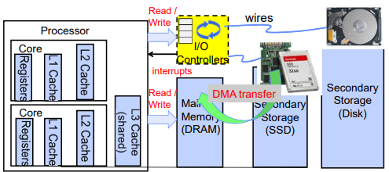
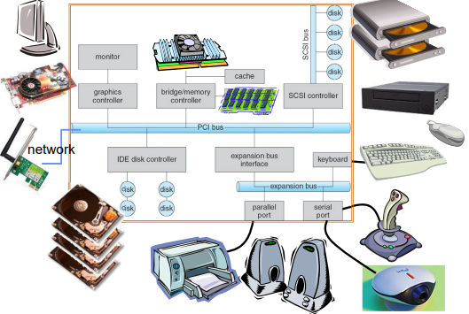

# 1. I/O

    
    

<!-- [I/O]
- Bus
buseas let us connect n ....
only one transaction at a time - others listen
pci bus evolved to pci express
How does the processor talk to the device (also interrupt) -> memory mapped is common and faster / safe by address translation
example -> boot driver defines where they go.(old ones needed jump cables)
- Transferring Data To/From Controller
low bandwidth devices like speakers can use programmed i/o, but for fast and large transer, DMA needed. DMA direct writing should not overlap cpu attached page. one way is to pre-invalidate pages, or simultaneously do invalidating with writing with DMA.
- I/O Device Notifying
network is great example of interrupt&polling - device normally provides both ways, so kernel can choose what to use.
- standard interfaces to devices - block device  and file system layer
- how use deals with timing with systemcall interface? - blocking, non-blocking, asynchronous
- Storage Devices - magnetic, flash - details
    - magnetic - disk performance example -> must sequential / avg rotation = half rotation time
    - ssd - high seq&random reads / before write, you need to erase cause only can do is to add electron -> free list management can be tricky. erasure : write : read = 100 : 10 : 1 / provide same interface to os (read and write chunk) - does ftl to fast things up 

L19
- Now let's consider queue. Queueing theory -->