- Thread & Processes
- Files & I/O
- IPC (& socket)


# 1. Threads and Processes

- Multiprocessing: Multiple CPUs(cores)
- Multiprogramming: Multiple jobs/processes
- Multithreading: Multiple threads/processes
- Concurrency: handling multiple things at once (in single-core)
- Parallelism: doing multiple things simultaneously (in multi-core)

## 1.1. Thread APIs

Some OS Library APIs for Threads: `pthreads`

```c
#include <pthread.h>

int pthread_create(pthread_t *restrict thread,
                    const pthread_attr_t *restrict attr,
                    void *(*start_routine)(void *),
                    void *restrict arg);
```
The `pthread_create()` function starts a new thread in the calling process. The new thread starts execution by invoking `start_routine();`. `arg` is passed as the sole argument of `start_routine()`. 

```c
#include <pthread.h>

[[noreturn]] void pthread_exit(void *retval);
```

The `pthread_exit()` function terminates the calling thread and returns a value via `retval` that (if the thread is joinable) is available to another thread in the same process that calls `pthread_join`.

```c
#include <pthread.h>

int pthread_join(pthread_t thread, void **retval);
```

The `pthread_join()` function waits for the thread specified by thread to terminate. If that thread has already terminated, then `pthread_join()` returns immediately. The thread specified by thread must be joinable.


* 'p' stands for `POSIX`, family of standards specified by the IEEE Computer Society for maintaining compatibility between operating systems. It's mostly a common interface for application programmers.

## 1.2. Thread State

Global variables, heap, I/O state(file descriptors, network connections, etc) are shared by all threads in process/address space. But there are some private things to each thread. These are TCB, CPU registers, execution stack(parameters, temporary variables, return PCs).

<p align="center">
    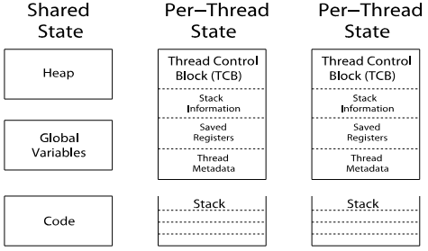
</p>

## 1.3. Correctness with Concurrent Threads

- Non-determinism: Scheduler can run/switch threads in any order/time. This makes testing difficult.
- Independent Threads: No state shared with other threads. This makes thread deterministic.
- Cooperating Threads: Shared state between multiple threads.
- Synchronization: Coordination among threads, usually regarding shared data.
- Mutual Exclusion: Ensuring only one thread does a particular thing at a time. (type of synchronization)
- Critical Section: Code exactly one thread can execute at once. (result of mutual exclusion)
- Lock: An object only one thread can hold at a time (provides mutual exclusion)

```c
#include <pthread.h>

int pthread_mutex_init(pthread_mutex_t *restrict mutex,
    const pthread_mutexattr_t *restrict attr);
pthread_mutex_t mutex = PTHREAD_MUTEX_INITIALIZER;

int pthread_mutex_lock(pthread_mutex_t *mutex);
int pthread_mutex_trylock(pthread_mutex_t *mutex);
int pthread_mutex_unlock(pthread_mutex_t *mutex);
```

The mutex object referenced by mutex shall be locked by a call to
`pthread_mutex_lock()` that returns zero or `EOWNERDEAD`.  If the
mutex is already locked by another thread, the calling thread
shall block until the mutex becomes available. This operation
shall return with the mutex object referenced by mutex in the
locked state with the calling thread as its owner. 

```c
#include <fcntl.h>           /* For O_* constants */
#include <sys/stat.h>        /* For mode constants */
#include <semaphore.h>

sem_t *sem_open(const char *name, int oflag); // initialize and open a named semaphore
sem_t *sem_open(const char *name, int oflag,
                mode_t mode, unsigned int value);

int sem_post(sem_t *sem); // increments (unlocks) the semaphore pointed to by sem

int sem_wait(sem_t *sem); // decrements (locks) the semaphore pointed to by sem.
int sem_trywait(sem_t *sem); // if the decrement cannot be immediately performed, then call returns an error
int sem_timedwait(sem_t *restrict sem,
                    const struct timespec *restrict abs_timeout); // timeout wait
```

Semaphores are a kind of generalized lock. Mutex can be said a 'binary semaphore'. 


## 1.4. Process Management API

```c
#include <stdlib.h>

/*
* exit - terminate a process
*/
[[noreturn]] void exit(int status);
```

<p align="center">
    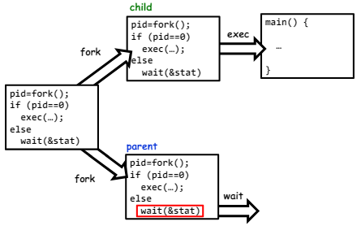
</p>

```c
#include <unistd.h>

/*
* fork - copy the current process (and create another process)
*   Windows uses CreateProcess() instead of fork()
*/
pid_t fork(void);

/*
* exec - change the program being run by the current process
*/
extern char **environ;

int execl(const char *pathname, const char *arg, ...
                /*, (char *) NULL */);
int execlp(const char *file, const char *arg, ...
                /*, (char *) NULL */);
int execle(const char *pathname, const char *arg, ...
                /*, (char *) NULL, char *const envp[] */);
int execv(const char *pathname, char *const argv[]);
int execvp(const char *file, char *const argv[]);
int execvpe(const char *file, char *const argv[], char *const envp[]);
```

```c
#include <sys/wait.h>

/*
* wait - wait for a process to finish
*/
pid_t wait(int *_Nullable wstatus);
pid_t waitpid(pid_t pid, int *_Nullable wstatus, int options);

int waitid(idtype_t idtype, id_t id, siginfo_t *infop, int options);
```

```c
#include <signal.h>

/*
* kill - send a signal (interrupt-like notification) to another process
*/
int kill(pid_t pid, int sig);

/*
* sigaction - set handlers for signals
*/
int sigaction(int signum,
                const struct sigaction *_Nullable restrict act,
                struct sigaction *_Nullable restrict oldact);
```

Common POSIX signals:
- `SIGINT`: ctrl+C
- `SIGTERM`: default kill (graceful termination)
- `SIGTSTP`: ctrl+z (stop process) until `SIGCONT` (graceful stop)
- `SIGKILL`: terminate process immediately
- `SIGSTOP`: stop process immediately until `SIGCONT`


# 2. Files and I/O

## 2.1. Everything is a File

Based on the system calls `open()`, `read()`, `write()`, and `close()`, this idea provides identical interface for:
- Files on disk
- Devices (terminals, printers, etc.)
- Regular files on disk
- Networking (sockets)
- Local interprocess communication (pipes, sockets)

* `ioctl()` for custom configuration that doesn't quite fit.

<p align="center">
    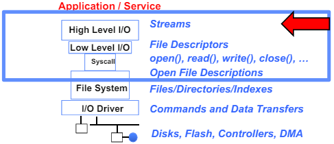
</p>

### 2.2. C High Level File API

Three predefined streams are opened implicitly when the program is executed:
- FILE *stdin : normal source of input, can be redirected
- FILE *stdout : normal source of output, can be redirected
- FILE *stderr : diagnostics and errors

```c
#include <stdio.h>

FILE *fopen(const char *restrict pathname, const char *restrict mode);
FILE *fdopen(int fd, const char *mode);
FILE *freopen(const char *restrict pathname, const char *restrict mode,
                FILE *restrict stream);

// character oriented  
int fputc( int c, FILE *fp ); // rtn c or EOF on err
int fputs( const char *s, FILE *fp ); // rtn > 0 or EOF
int fgetc( FILE * fp ); // Keeps up with your SSD
char *fgets( char *buf, int n, FILE *fp );


// block oriented
size_t fread(void *ptr, size_t size_of_elements,
size_t number_of_elements, FILE *a_file);
size_t fwrite(const void *ptr, size_t size_of_elements,
size_t number_of_elements, FILE *a_file);


// formatted
int fprintf(FILE *restrict stream, const char *restrict format, ...);
int fscanf(FILE *restrict stream, const char *restrict format, ... );

// positioning the pointer
long ftell(FILE *stream); // obtains the current value of the file position indicator
int fseek(FILE *stream, long offset, int whence); // sets the file position indicator for the stream

void rewind(FILE *stream); // set file position indicator to the beginning of the file

int fgetpos(FILE *restrict stream, fpos_t *restrict pos); // alternate for ftell
int fsetpos(FILE *stream, const fpos_t *pos); // alternate for fseek
```

#### Example: Char-by-Char I/O

```c
int main(void) {
    FILE* input = fopen(“input.txt”, “r”);
    FILE* output = fopen(“output.txt”, “w”);
    if (input == NULL) perror("Failed to open input file"); // make sure to check error
    if (output == NULL) perror("Failed to open output file");

    int c;
    c = fgetc(input);
    while (c != EOF) {
        fputc(output, c);
        c = fgetc(input);
    }
    fclose(input);
    fclose(output);
}
```

#### Example: Block-by-Block I/O
```c
#define BUFFER_SIZE 1024
int main(void) {
    FILE* input = fopen("input.txt", "r");
    FILE* output = fopen("output.txt", "w");
    char buffer[BUFFER_SIZE];
    size_t length;
    length = fread(buffer, BUFFER_SIZE, sizeof(char), input);
    while (length > 0) {
        fwrite(buffer, length, sizeof(char), output);
        length = fread(buffer, BUFFER_SIZE, sizeof(char), input);
    }
    fclose(input);
    fclose(output);
}
```

### 2.3. Low Level File I/O: RAW system-call interface

```c
// wrapper of systemcall
#include <fcntl.h>

int open(const char *pathname, int flags, ...
            /* mode_t mode */ );

int creat(const char *pathname, mode_t mode);

int openat(int dirfd, const char *pathname, int flags, ...
            /* mode_t mode */ );

#include <unistd.h>

int close(int fd);
```

`Open system call` create an open file description entry in system-wide table of open files. Open file description object in the kernel represents an instance of an open file. This syscall returns an integer represents file descriptor to prevent user program to access kernel memory space directly.

```c
#include <unistd.h>
STDIN_FILENO ‐ macro has value 0
STDOUT_FILENO ‐ macro has value 1
STDERR_FILENO ‐ macro has value 2
// Get file descriptor inside FILE *
int fileno(FILE *stream)
// Make FILE * from descriptor
FILE * fdopen(int filedes, const char *opentype)

ssize_t read(int fd, void buf[.count], size_t count); // Reads up to maxsize bytes – might actually read less!
ssize_t write(int fd, const void buf[.count], size_t count); // returns number of bytes written
off_t lseek(int fd, off_t offset, int whence); // reposition file offset within kernel
```

#### Example: lowio.c
```c
int main() {
    char buf[1000];
    int     fd = open("lowio.c", O_RDONLY, S_IRUSR | S_IWUSR);
    ssize_t rd = read(fd, buf, sizeof(buf));
    int    err = close(fd);
    ssize_t wr = write(STDOUT_FILENO, buf, rd);
}
```

When designing I/O process, make sure to follow this sequence (POSIC I/O design pattern):

- Open before use
  - Access control check, setup happens here
- Byte-oriented
  - Least common denominator
  - OS responsible for hiding the fact that real devices may not work this way (e.g. hard drive stores data in blocks)
- Explicit close

Other Low-Level I/O ops: `ioctl`, `dup2`, `dup`, `pipe`, etc.

### 2.4. Why High Level File I/O

When using high-level API, it does more thing than direct systemcall. `File*` has:
- File descriptor
- Buffer (user level, array)
- Lock (for thread-safe)
- others

Even kernel has buffering mechanism, high-level i/o adds user-level buffering. This means that calls to functions like `printf()` write data to a buffer in user space, and this buffer gets flushed to the kernel (and thus to the file or terminal) under certain conditions (e.g., when the buffer is full, when a newline is encountered in line-buffered devices, or when you explicitly flush the buffer). This buffering mechanism reduces the number of system calls, which are expensive operations. (`Syscalls are 25x more expensive` than function calls) Of course, we can manually flush user space buffer.


```c
char x = 'c';
FILE* f1 = fopen("file.txt", "wb");
fwrite("b", sizeof(char), 1, f1);
fflush(f1); // fclose also flushes user level buffer
FILE* f2 = fopen("file.txt", "rb");
fread(&x, sizeof(char), 1, f2);
```

Your code should behave correctly regardless of when C Standard Library flushes its buffer. With the low-level file API, we don’t have this problem.

### 2.5. Process State for File Descriptors

For each process, kernel maintains mapping from file descriptor to open file description. On future system calls (e.g., `read()`), kernel looks up open file description using file descriptor and uses it to service the system call:

```c
char buffer1[100];
char buffer2[100];
int fd = open("foo.txt", O_RDONLY);
read(fd, buffer1, 100); // the kernel remembers that the int it receives corresponds to foo.txt
read(fd, buffer2, 100); // the kernel picks up where it left off in the file
```

<p align="center">
    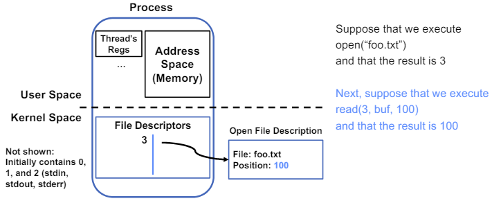
    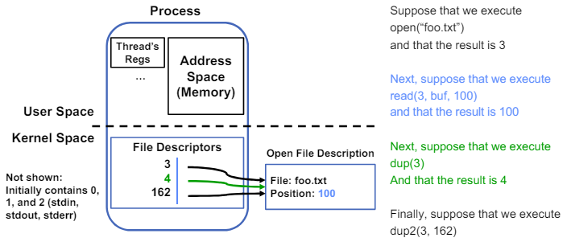
</p>

### 2.6. Cautions

#### 2.6.1. DON’T FORK() IN A PROCESS THAT ALREADY HAS MULTIPLE THREADS

The child process always has just a single thread.  The other threads just vanish.

<p align="center">
    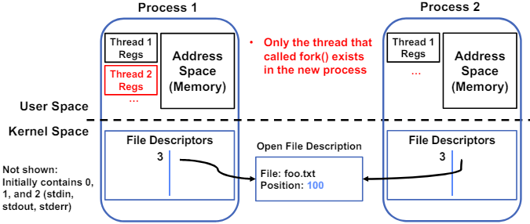
</p>

#### 2.6.2. DON’T CARELESSLY MIX LOW-LEVEL AND HIGH-LEVEL FILE I/O

```c
char x[10];
char y[10];
FILE* f = fopen("foo.txt", "rb");
int fd = fileno(f);
fread(x, 10, 1, f); // read 10 bytes from f
read(fd, y, 10); // assumes that this returns data starting at offset 10
```
 The `fread()` reads a big chunk of file into user-level buffer. So `y` might be all of the file. (?)


 #### 2.6.3. BE CAREFUL WITH FORK() AND FILE*

 ```c
FILE* f = fopen("foo.txt", "w");
fwrite("a", 1, 1, f);
fork();
fclose(f);
```

`foo.txt` coulb be either a or aa. This is because `fork()` copies all the memory space including `FILE*`.

<p align="center">
    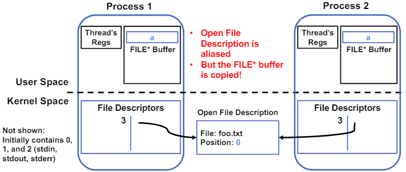
</p>


# 3. IPC, Pipes and Sockets

`IPC`: Communication facility between protected environments (i.e. processes)

<p align="center">
    
</p>

## 3.1. Communication Between Processes
### 3.1.1. Simple option: file
Very expensive if you only want transient communication (non-persistent)

<p align="center">
    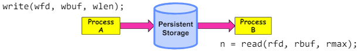
</p>
  
### 3.1.2. Better option: shared memory

Although we chose to map different process to access different memory space, we can choose them to share certain space of memory. This is pretty uncontrolled, but this is fast.

<p align="center">
    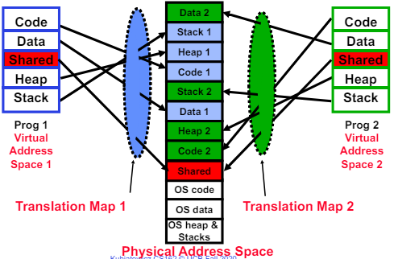
</p>

### 3.1.3. Another option: in-memory queue

Suppose we ask kernel to help. Kernel manages in-memory queue, and processes access via system calls (for security reasons).

<p align="center">
    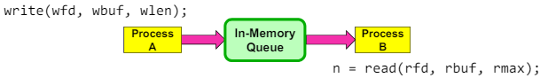
</p>

But...it remains some questions:
- How to set up?
  - POSIX/Unix PIPE (pipes are an abstraction of a single queue)
- What if A generates data faster than B can consume it?
  - If producer (A) tries to write when buffer full, it blocks (Put sleep until space)
- What if B consumes data faster than A can produce it?
  - If consumer (B) tries to read when buffer empty, it blocks (Put to sleep until data)
- How do we know queue has value?
  - Kernel will know that information

example:
```c
#include <unistd.h>
int main(int argc, char *argv[])
{
    char *msg = "Message in a pipe.\n";
    char buf[BUFSIZE];
    int pipe_fd[2];
    if (pipe(pipe_fd) == ‐1) { // makes pipe fds (blue one in picture below)
        fprintf (stderr, "Pipe failed.\n"); return EXIT_FAILURE;
    }
    ssize_t writelen = write(pipe_fd[1], msg, strlen(msg)+1);
    printf("Sent: %s [%ld, %ld]\n", msg, strlen(msg)+1, writelen);

    ssize_t readlen = read(pipe_fd[0], buf, BUFSIZE);
    printf("Rcvd: %s [%ld]\n", msg, readlen);

    close(pipe_fd[0]);
    close(pipe_fd[1]);
}
```
or, 
```c
#include <unistd.h>
int main(int argc, char *argv[])
{
    char *msg = "Message in a pipe.\n";
    char buf[BUFSIZE];
    int pipe_fd[2];
    if (pipe(pipe_fd) == ‐1) {
        fprintf (stderr, "Pipe failed.\n"); return EXIT_FAILURE;
    }
    pid_t pid = fork(); // fork process to show ipc (green in picture below)
    if (pid < 0) {
        fprintf (stderr, "Fork failed.\n");
        return EXIT_FAILURE;
    }
    if (pid != 0) {
        ssize_t writelen = write(pipe_fd[1], msg, msglen);
        printf("Parent: %s [%ld, %ld]\n", msg, msglen, writelen);
    } else {
        ssize_t readlen = read(pipe_fd[0], buf, BUFSIZE);
        printf("Child Rcvd: %s [%ld]\n", msg, readlen);
    }
    close(pipe_fd[0]);
    close(pipe_fd[1]);
}
```

<p align="center">
    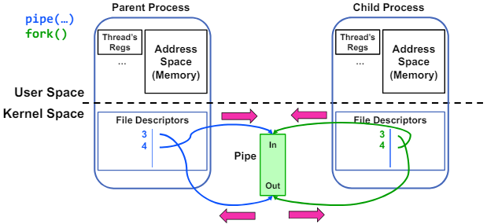
</p>


## 3.2. IPC accross network: RPC

A `protocol` is an agreement on how to communicate
 - `Syntax`: how a communication is specified & structured
    - Format, order messages are sent and received
  - `Semantics`: what a communication means
    - Actions taken when transmitting, receiving, or when a timer expires

### 3.2.1. Client-Server Protocols: Cross-Network IPC

Many clients are accessing a common server. How the server differs those clients? -> Port

<p align="center">
    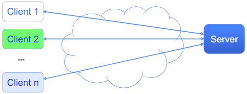
</p>

Abstractly, a connection between two endpoints A and B consists of:
- A queue (bounded buffer) for data sent from A to B
- A queue (bounded buffer) for data sent from B to A

This is similar to the pipe.

<p align="center">
    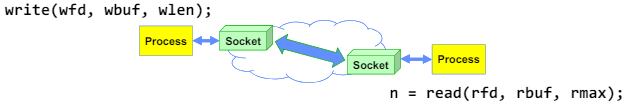
</p>

`Socket` is an abstraction for one endpoint of a network connection. This is another mechanism for IPC. We can say that sockets are an abstraction of two queues, one in each direction. Most operating systems (Linux, Mac OS X, Windows) provide this, even if they don’t copy rest of UNIX I/O. This is standardized by POSIX. It looks just like a file with a file descriptor. `write` adds to output queue (queue of data destined for other side), and `read` removes from it input queue (queue of data destined for this side). Some operations like `lseek` do not work.

But some questions remain:
- How do we `open()`?
- What is the namespace?
  - Hostname, IP address, Port
- How are they connected in time?
  - server socket & connection socket

Green boxes are in the kernel (there are two sockets: client, server):
<p align="center">
    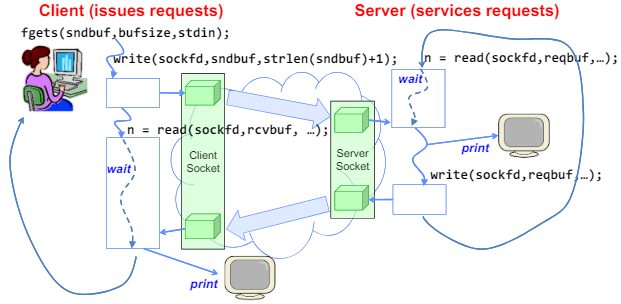
    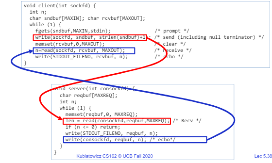
    
</p>

`Server socket` is special kind of socket. It has file descriptor, and cannot read or write. It has two operations:
- `listen()`: Start allowing clients to connect
- `accept()`: Create a new socket for a particular client
"
<p float="left">
    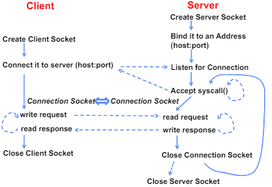
    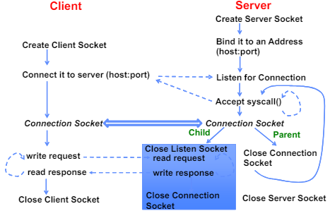
</p>


server code:
```c
struct addrinfo *setup_address(char *port) {
    struct addrinfo *server;
    struct addrinfo hints;
    memset(&hints, 0, sizeof(hints));
    hints.ai_family = AF_UNSPEC;
    hints.ai_socktype = SOCK_STREAM; // tcp/ip
    hints.ai_flags = AI_PASSIVE;
    getaddrinfo(NULL, port, &hints, &server);
    return server;
}


int main(int argc, char *argv[]) {
    // Create socket to listen for client connections
    char *port_name;
    struct addrinfo *server = setup_address(port_name);
    int server_socket = socket(server‐>ai_family, server‐>ai_socktype, server‐>ai_protocol);
    // Bind socket to specific port
    bind(server_socket, server‐>ai_addr, server‐>ai_addrlen);
    // Start listening for new client connections
    listen(server_socket, MAX_QUEUE);
    while (1) {
        /**
        * one connection in time
        */
        // // Accept a new client connection, obtaining a new socket
        // int conn_socket = accept(server_socket, NULL, NULL);
        // serve_client(conn_socket);
        // close(conn_socket);

        /**
        * multiple connection in time
        */
        // Accept a new client connection, obtaining a new socket
        int conn_socket = accept(server_socket, NULL, NULL);
        pid_t pid = fork();
        if (pid == 0) { // child
            close(server_socket);
            serve_client(conn_socket);
            close(conn_socket);
            exit(0);
        } else { // parent
            close(conn_socket);
            // wait(NULL);
        }
    }
    close(server_socket);
}
```

client code:
```c
struct addrinfo *lookup_host(char *host_name, char *port) {
    struct addrinfo *server;
    struct addrinfo hints;
    memset(&hints, 0, sizeof(hints));
    hints.ai_family = AF_UNSPEC;
    hints.ai_socktype = SOCK_STREAM;
    int rv = getaddrinfo(host_name, port_name,
    &hints, &server);
    if (rv != 0) {
        printf("getaddrinfo failed: %s\n", gai_strerror(rv));
        return NULL;
    }
    return server;
}


char *host_name, *port_name;
// Create a socket
struct addrinfo *server = lookup_host(host_name, port_name);
int sock_fd = socket(server‐>ai_family, server‐>ai_socktype,
server‐>ai_protocol);
// Connect to specified host and port
connect(sock_fd, server‐>ai_addr, server‐>ai_addrlen);
// Carry out Client‐Server protocol
run_client(sock_fd);
/* Clean up on termination */
close(sock_fd);
```


