- TCB, Context switching
- milk problem & lock implementation
- monitor - bounded buffer problem, reader/writer problem


# 1. Concurrency and Mutual Exclusion

## 1.1. How process/thread executes

<p float="left">
    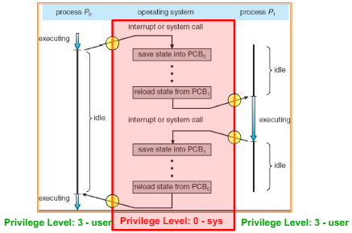
    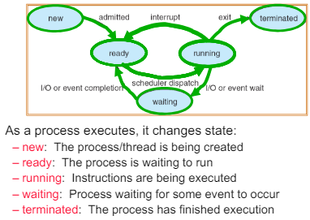
</p>

Process/Thread, switches periodically(depending on scheduler's rule), or if it calls I/O request, syscall, it will sent back to waiting queue.

<p align="center">
    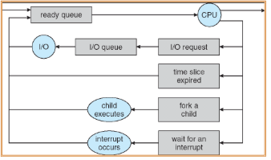
</p>

PCBs move from queue to queue. Rather than ready queue, there are lots of different device/signal/condition queues like USB Unit 0 queue, USB Unit 1 queue, ..., Disk Unit 0 queue, ..., Ethernet 0 queue, ..., etc. Each queue can have a different scheduler policy.

Conceptually, the scheduling loop of the operating system looks as follows:
```
Loop {
    RunThread();
    ChooseNextThread();
    SaveStateOfCPU(curTCB);
    LoadStateOfCPU(newTCB);
} // power shutdown, kernel panic would exit this loop
```

How do I run a thread?
- Load its state (registers, PC, stack pointer) into CPU
- Load environment (virtual memory space, etc)
- Jump to the PC

### 1.1.1. How does the dispatcher get control back?
#### Internal events: thread returns control voluntarily

- Blocking on I/O
  - The act of requesting I/O implicitly yields the CPU
- Waiting on a 'signal' from other thread
  - Thread asks to wait and thus yields the CPU
- Thread executes a `yield()`
  - Thread volunteers to give up CPU
```
computePI() {
    while(TRUE) {
        ComputeNextDigit(); // it's not a good example since computing pi goes slower when digit goes far.
        yield(); // gives control back to kernel
    }
}
```

Let's dive to `yield`.
<p align="center">
    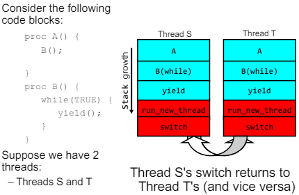
</p>

Blue is user code, red is kernel level. (we're using one-to-one threading model)

If Thread S starts first, it's stack start with A(). Then it invokes B(), and then yield(). yield() calls run_new_thread() of kernel(this point control got to the kernel), and kerne calls switch(). Once same operation happens for Thread T, Thread S's switch() returns, ..., yield() returns. And again, Thread S calls yield(), ...

What's happening in `switch()`? pseudo-code might like:
```
Switch(tCur,tNew) {
    /* Unload old thread */
    TCB[tCur].regs.r7 = CPU.r7;
    …
    TCB[tCur].regs.r0 = CPU.r0;
    TCB[tCur].regs.sp = CPU.sp;
    TCB[tCur].regs.retpc = CPU.retpc; /*return addr*/
    /* Load and execute new thread */
    CPU.r7 = TCB[tNew].regs.r7;
    …
    CPU.r0 = TCB[tNew].regs.r0;
    CPU.sp = TCB[tNew].regs.sp;
    CPU.retpc = TCB[tNew].regs.retpc;
    return; /* Return to CPU.retpc */
}
```

Isn't it expensive in context switching? => Yes, but our one-to-one model is fast enough.

- Frequency of context switch: 10-100ms
- Switching between processes: 3-4 μsec.
- Switching between threads: 100 ns

<p align="center">
    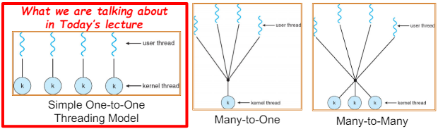
</p>

Our model, one-to-one model, has one kernel stack for each threads. Of course, user cannot access that kernel stack in the thread. Kernel structure would be like:

<p align="center">
    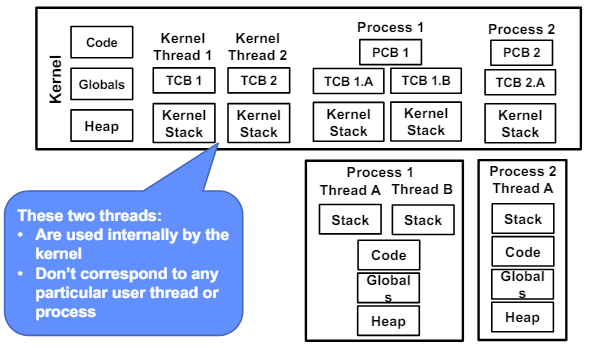
</p>

#### External events: thread gets preempted

What happens if thread never does any I/O, never waits, and never yields control?

=> Answer: utilize external events
- Interrupts: signals from hardware or software that stop the running code and jump to kernel
- Timer: like an alarm clock that goes off every some milliseconds

<p align="center">
    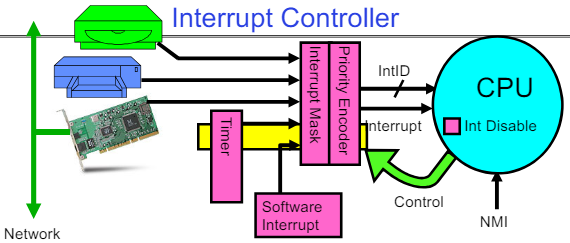
</p>

- Interrupts invoked with interrupt lines from devices. 
- Interrupt controller chooses interrupt request to honor
  - Interrupt identity specified with ID line
  - Mask enables/disables interrupts
  - Priority encoder picks highest enabled interrupt
  - Software Interrupt Set/Cleared by Software
- CPU can disable all interrupts with internal flag
- Non-Maskable Interrupt line (NMI) can’t be disabled

### 1.1.2. How does Thread get started?

<p align="center">
    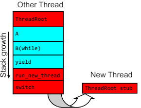
</p>

1. Allocate and Initialize TCB
   - This includes memory allocation, thread id/state/register/priority for scheduling initialization
2. Allocate and Set Up the Stack Frame
   - This includes memory allocation, stack pointer initialization

pseudo-code generated by ChatGPT 4o
```c
struct TCB {
    int thread_id;
    int state;
    void *stack_pointer;
    void *program_counter;
    int priority;
    // Other registers and scheduling information...
};

void create_thread(void (*start_routine)(void), void *arg) {
    // Allocate and initialize TCB
    TCB *tcb = (TCB *)malloc(sizeof(TCB));
    tcb->thread_id = generate_unique_thread_id();
    tcb->state = READY;
    tcb->priority = DEFAULT_PRIORITY;

    // Allocate stack memory
    void *stack = malloc(STACK_SIZE);
    
    // Set up the initial stack frame
    void **stack_top = (void **)((char *)stack + STACK_SIZE);
    *--stack_top = arg; // Argument to start_routine
    *--stack_top = NULL; // Dummy return address
    *--stack_top = start_routine; // Initial program counter (PC)

    // Initialize the stack pointer (SP)
    tcb->stack_pointer = stack_top;

    // Initialize the program counter (PC)
    tcb->program_counter = start_routine;

    // Add the TCB to the ready queue
    add_to_ready_queue(tcb);
}

void thread_start() {
    // Function to start the thread execution
    TCB *current_tcb = get_current_tcb();
    void (*start_routine)(void) = (void (*)(void))(current_tcb->program_counter);
    void *arg = (void *)(*(void **)(current_tcb->stack_pointer));
    start_routine(arg); // Start the thread
}
```

### 1.1.3. Processes & Threads

<table>
<tr>
<td>
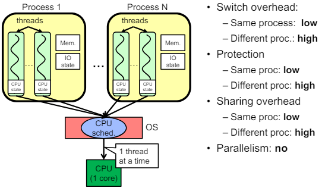
</td>
<td>
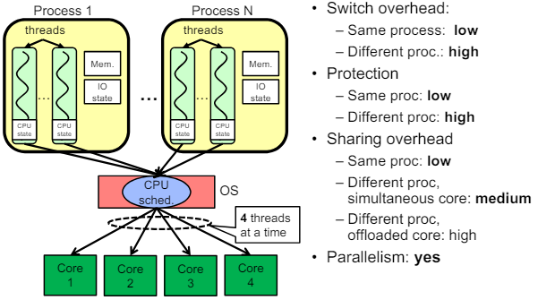
</td>
</tr>
</table>

## 1.2. Correctness with Concurrent Threads

We have to assume that scheduler can run threads in any order, at any time. So we need to design multi threaded code very carefully.

### 1.2.1.  Atomic Operation

`Atomic Operation`: an operation that always runs to completion or not at all

- It is `indivisible`: it cannot be stopped in the middle and state cannot be modified
by someone else in the middle
- Fundamental building block: if no atomic operations, then have no way for
threads to work together


**Use lock, semaphore, conditional_variable.**

#### Use a separate semaphore for each constraint

example:
```c
Semaphore fullSlots = 0; // Initially, no coke
Semaphore emptySlots = bufSize; // Initially, num empty slots
Semaphore mutex = 1; // No one using machine

Producer(item) {
    semaP(&emptySlots); // Wait until space
    semaP(&mutex); // Wait until machine free
    Enqueue(item);
    semaV(&mutex);
    semaV(&fullSlots); // Tell consumers there is more coke
}
Consumer() {
    semaP(&fullSlots); // Check if there’s a coke
    semaP(&mutex); // Wait until machine free
    item = Dequeue();
    semaV(&mutex);
    semaV(&emptySlots); // tell producer need more
    return item;
}
```


# 2. Lock Implementation, Atomic Instructions

Let's start from scratch. Milk problem shows why we need lock interface, and will show how to implement the lock.

## 2.1. Too Much Milk

Suppose Person A and Person B wants to buy and put a milk in the fridge if it's empty.

<p align="center">
    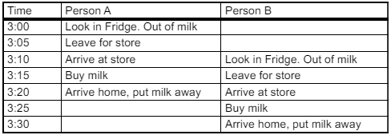
</p>

Problem like above can be dealt using `Lock`. For instance, think about putting a key on the refrigerator that locks the fridge and take key if you are going to go but milk. But it will make another person angry if he/she only wants coke. (Of course, we don't know how to make a lock yet)

### 2.1.1. Too Much Milk: Solution 1

Suppose a computer(with single core) tries this:
```c
if (noMilk) {
    if (noNote) {
        leave Note;
        buy milk;
        remove note;
    }
}
```
But then, this could happen:

<table>
<tr><td>Thread A</td><td>Thread B</td></tr>
<tr>
<td>

```c
if (noMilk) {


    if (noNote) {
        leave Note;
        buy milk;
        remove note;
    }
}


```
</td>
<td>
    
```c

if (noMilk) {
    if (noNote) {


        leave Note;
        buy milk;
        remove note;
    }
}
```
</td>
</tr>
</table>

Thread A's first line executes and interleaves, then Thread B's first&second line executes. both thread will try to leave note, buy milk.

### 2.1.2. Too Much Milk: Solution 2

How about leaving a Note first? It's the `Lock`, right?
```c
leave Note;
if (noMilk) {
    if (noNote) {
        buy milk;
    }
}
remove Note;
```
But then, it's possible for neither thread to but milk:

<table>
<tr><td>Thread A</td><td>Thread B</td></tr>
<tr>
<td>

```c
leave NoteA;

if (noMilk) {
    if (noNoteB) {


        buy milk;
    }
}
remove NoteA;
```
</td>
<td>
    
```c

leave NoteB;


if (noMilk) {
    if (noNoteA) {
        buy milk;
    }
}
remove NoteB;


```
</td>
</tr>
</table>


### 2.1.3. Too Much Milk: Solution 3

Little bit of twick can make solution2 safe:
<table>
<tr><td>Thread A</td><td>Thread B</td></tr>
<tr>
<td>

```c
leave NoteA;
while (noteB) {
    do nothing;
}
if (noMilk) {
    buy milk;
}
remove NoteA;
```
</td>
<td>
    
```c
leave NoteB;
if (noNoteA) {
    if (noMilk) {
        buy milk;
    }
}
remove NoteB;

```
</td>
</tr>
</table>

If 'leave NoteA' happened before second line of Thread B, Thread B will never buy a milk. Only Thread A can buy a milk. And if second line of Thread B happened before Thread A starts, only Thread B will but a milk. This can be generalized to n-Threads (Leslie Lamport’s “Bakery
Algorithm” (1974))

This works, but there are some problems:
- It's really complex, even for this simple example.
- A's code is different from B's. What if there are lots of thread? How should we write code?
- A is busy waiting.

### 2.1.4. Too Much Milk: Solution 4

Recall our target lock interface:
- `acquire(&milklock)` – wait until lock is free, then grab
- `release(&milklock)` – Unlock, waking up anyone waiting
- These must be atomic operations – if two threads are waiting for the lock and both see it’s free, only one succeeds to grab the lock.

Then, out milk problem is easy:
```c
acquire(&milklock);
if (nomilk)
    buy milk;
release(&milklock);
```

## 2.2. Lock Implementation

Lock prevents someone from doing something. We use lock before entering critical section or before accessing shared data. We unlock when leaving or after accessing shared data. Important idea when implementing the lock is that all synchronization involves waiting. Should sleep if waiting for a long time.

There are several ways to implement the `Lock`.

### 2.2.1. Lock Implementation 1: Interrupt Enable/Disable

<table>
<tr>
<td>

```c
int vale = FREE;

Acquire() {
    disable interrupts;
    if (value == BUSY) {
        put thread on wait queue;
        Go to sleep();
    } else {
        value = BUSY;
    }
    enable interrupts; // can we enable faster?
}

```
</td>
<td>

```c


Release() {
    disable interrupts;
    if (anyone on wait queue) {
        take thread off wait queue
        Place on ready queue;
    } else {
        value = FREE;
    }
    enable interrupts;
}

```
</td>
</tr>
</table>

This works. But what about re-enabling interrupts when going to sleep? (in `Acquire()`)
- Before putting thread on the wait queue
  - `Release()` can check the queue and not wake up thread
- After putting thread on the wait queue
  - Could happen: immediate interleave -> `Release()` puts TCB on the ready queue, interleaves -> `Acquire()` thread still goes to sleep -> no one will wake it up, holding the lock. (deadlock)

So we want to enable interrupt after going to sleep.

<p align="center">
    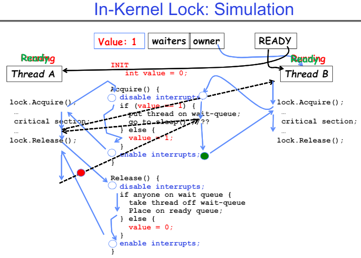
</p>

Thread A starts by acquiring the lock, and does it's job. Interleaves when doing critical section. Now Thread A is on Ready queue, Thread B gets owner's running state. Thread B is blocked when acquiring, goes to sleep. Thread A runs again, Release the lock and wakes up Thread B. Now Thread B runs it's critical section.

<p align="center">
    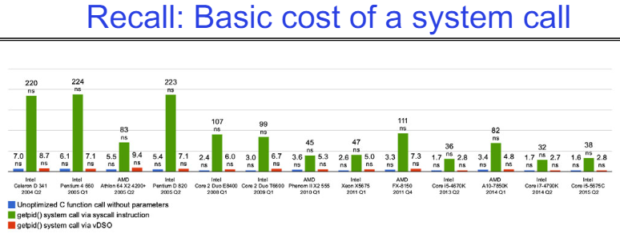
</p>

But, this is not good enough. User->Kernel, Kernel->User context switch overhead is too much. (Syscall ~25x cost of function call) Also, as the number of cores increase, disabling&enabling interrupts on all processors requires messages and would be very time consuming.

### 2.2.2. Lock Implementation 2: Hardware provides atomic instruction sequences

We can use atomic instruction sequences. These instructions read a value and write a new value atomically. Hardware is responsible for implementing this correctly. TAS(Test-and-Set) is used for most architectures.

```c
test&set (&address) {           /* most architectures */
    result = M[address];        // return result from “address” and
    M[address] = 1;             // set value at “address” to 1
    return result;
}

swap (&address, register) {     /* x86 */
    temp = M[address];          // swap register’s value to
    M[address] = register;      // value at “address”
    register = temp;
}

compare&swap (&address, reg1, reg2) { /* x86 (returns old value), 68000 */
        if (reg1 == M[address]) {   // If memory still == reg1,
            M[address] = reg2;      // then  put reg2 => memory
            return success;
        } else {                    // Otherwise do not change memory
            return failure;
    }
}

load‐linked&store‐conditional(&address) { /* R4000, alpha */
    loop:
        ll r1, M[address];
        movi r2, 1; // Can do arbitrary computation
        sc r2, M[address];
        beqz r2, loop;
}
```

Now we can modify lock implementation using TAS.

#### 2.2.2.1. Simplest Approach

<table>
<tr>
<td>

```c
int mylock = 0; // Free

Acquire() {
    while(test&set(&mylock));
}
```
</td>
<td>

```c


Release() {
    mylock = 0;
}
```
</td>
</tr>
</table>

This solution can receive interrupts, and works on multiprocessor. But it's very inefficient as thread will consume cycles waiting. Waiting thread may take cycles away from thread holding lock. And if busy-waiting thread has higher priority than thread holding lock, no one can make progress. (priority inversion). Also, for multiprocessors, since test&set() has write operation, this makes value ping-pong around cache, thus using lots of network bandwidth.

#### 2.2.2.2. test&test&set

<table>
<tr>
<td>

```c
int mylock = 0; // Free

Acquire() {
do {
    while(mylock);   // Wait until might be free (long busy waiting)
} while(test&set(&mylock)); // exit if get lock
}
```
</td>
<td>

```c


Release() {
    mylock = 0;
}


```
</td>
</tr>
</table>

Since our busy waiting is mostly read operation, caching problem is almost solved. But it's still busy waiting.

#### 2.2.2.3. Better Solution

<table>
<tr>
<td>

```c
int guard = 0; // Global Variable!
int mylock = FREE; // Interface: acquire(&mylock);
                   //            release(&mylock);
acquire(int *thelock) {
    // Short busy‐wait time
    while (test&set(guard));
    if (*thelock == BUSY) {
        put thread on wait queue;
        go to sleep() & guard = 0;
        // guard == 0 on wakup!
    } else {
        *thelock = BUSY;
        guard = 0;
    }
}
```
</td>
<td>

```c


release(int *thelock) {
    // Short busy‐wait time
    while (test&set(guard));
    if anyone on wait queue {
        take thread off wait queue
        Place on ready queue;
    } else {
        *thelock = FREE;
    }
    guard = 0;
}

```
</td>
</tr>
</table>

This solution limits busy waiting in acquire&release function. It's still busy-waiting, but acquire&release functions will return soon.

Basically we replaced:
- `disable interrupts` -> `while (test&set(guard));`
- `enable interrupts` -> `guard = 0;`


### 2.2.3. Lock Implementation 3: futex

A `futex` (fast userspace mutex) is a kernel system cal lthat programmers can use to implement basic locking, or as a building block for higher-level locking abstractions such as semephores and POSIX mutexes or condition variables.

`futex` is not exposed in libc. It's used within the implementation of pthreads. `man7` page shows synopsis like:
```c
#include <linux/futex.h>      /* Definition of FUTEX_* constants */
#include <sys/syscall.h>      /* Definition of SYS_* constants */
#include <unistd.h>

long syscall(SYS_futex, uint32_t *uaddr, int futex_op, uint32_t val,
            const struct timespec *timeout,   /* or: uint32_t val2 */
            uint32_t *uaddr2, uint32_t val3);
```
But let's assume it has interface:
```c
#include <linux/futex.h>
#include <sys/time.h>
int futex(int *uaddr, int futex_op, int val,
            const struct timespec *timeout );
```
where

- `uaddr`: points to a 32-bit value in user space
- `futex_op`
  - `FUTEX_WAIT`: if val == *uaddr sleep till `FUTEX_WAKE`
    - Atomic check that condition still holds after we disable interrupts (in kernel)
  - `FUTEX_WAKE`: wake up at most `val` waiting threads
  - `FUTEX_FD`, `FUTEX_WAKE_OP`, `FUTEX_CMP_REQUEUE`: More interesting operations!
- timeout
– ptr to a timespec structure that specifies a timeout for the op

#### 2.2.3.1. Solution 1

<table>
<tr>
<td>

```c
int mylock = 0; // Interface: acquire(&mylock);
                //            release(&mylock);
acquire(int *thelock) {
    while (test&set(thelock)) {
        futex(thelock, FUTEX_WAIT, 1);
    }
}
```
</td>
<td>

```c


release(int *thelock) {
    thelock = 0; // unlock
    futex(&thelock, FUTEX_WAKE, 1);
}

```
</td>
</tr>
</table>

This solution is nice. No busywaits, and there's no overhead acquiring lock. But every unlock has to call kernel to potentially wake someone up, even there's none. This doesn't quite give us no-kernel crossings when uncontended. Let's do better.

#### 2.2.3.2. Solution 2: record if goes sleep

<table>
<tr>
<td>

```c
bool maybe_waiters = false;
int mylock = 0; // Interface: acquire(&mylock,&maybe_waiters);
                //            release(&mylock,&maybe_waiters);
acquire(int *thelock, bool *maybe) {
    while (test&set(thelock)) {
        // Sleep, since lock busy!
        *maybe = true;
        futex(thelock, FUTEX_WAIT, 1);
        // Make sure other sleepers not stuck
        *maybe = true;
    }
}
```
</td>
<td>

```c


release(int*thelock, bool *maybe) {
    value = 0;
    if (*maybe) {
        *maybe = false;
        // Try to wake up someone
        futex(&value, FUTEX_WAKE, 1);
    }
}

```
</td>
</tr>
</table>

This is syscall-free in the uncontended case. But can temporarily falls back to syscalls if multiple waiters, or concurrent acquire/release. We can do better.

#### 2.2.3.3. Solution 3: better, using more atomics

<table>
<tr>
<td>

```c
typedef enum { UNLOCKED,LOCKED,CONTESTED } Lock;
Lock mylock = UNLOCKED; // Interface: acquire(&mylock);
                        //            release(&mylock);
acquire(Lock *thelock) {
    // If unlocked, grab lock!
    if (compare&swap(thelock, UNLOCKED, LOCKED))
        return;
    // Keep trying to grab lock, sleep in futex
    while (swap(mylock, CONTESTED) != UNLOCKED))
        // Sleep unless someone releases hear!
        futex(thelock, FUTEX_WAIT, CONTESTED);
}
```
</td>
<td>

```c


release(Lock *thelock) {
    // If someone sleeping,
    if (swap(thelock, UNLOCKED) == CONTESTED)
        futex(thelock,FUTEX_WAKE,1);
}
```
</td>
</tr>
</table>


# 3. Monitor

A `Monitor` is a paradigm for concurrent programming. This uses `a lock` and zero or more `conditional variables` for managing concurrent access to shared data. Some languages like Java provides this natively. 

## 3.1. Bounded Buffer

Recall the full solution to bounded buffer (coke machine)
```c
Semaphore fullSlots = 0; // Initially, no coke
Semaphore emptySlots = bufSize;
// Initially, num empty slots
Semaphore mutex = 1; // No one using machine

Producer(item) {
    semaP(&emptySlots); // Wait until space
    semaP(&mutex); // Wait until machine free
    Enqueue(item);
    semaV(&mutex);
    semaV(&fullSlots); // Tell consumers there is more coke
}

Consumer() {
    semaP(&fullSlots); // Check if there’s a coke
    semaP(&mutex); // Wait until machine free
    item = Dequeue();
    semaV(&mutex);
    semaV(&emptySlots); // tell producer need more coke
    return item;
}
```

Semaphores are a huge step up. Just think of trying to do the bounded buffer with only loads and stores or even with locks. But there's also a problem, `semaphore is used in dual purpose`, i.e. they are used for both mutex and scheduling constraints. Using `locks` for mutual exclusion and `condition variables` for scheduling constraints would be more cleaner idea.

- `Wait(&lock)`: Atomically release lock and go to sleep. Re-acquire lock later, before returning.
- `Signal()`: Wake up one waiter, if any
- `Broadcast()`: Wake up all waiters

### 3.1.1. Bounded Buffer Solution 1: infinite queue

```c
lock buf_lock; // Initially unlocked
condition buf_CV; // Initially empty
queue queue;

Producer(item) {
    acquire(&buf_lock); // Get Lock
    enqueue(&queue,item); // Add item
    cond_signal(&buf_CV); // Signal any waiters
    release(&buf_lock); // Release Lock
}

Consumer() {
    acquire(&buf_lock); // Get Lock
    while (isEmpty(&queue)) {
        cond_wait(&buf_CV, &buf_lock); // If empty, sleep
    }
    item = dequeue(&queue); // Get next item
    release(&buf_lock); // Release Lock
return(item);
}
```

Here, `Lock` provides mutual exclusion to shared data, `Condition Variable` makes it possible to go to sleep inside critical section by atomically releasing lock at time the thread go to sleep.

Why `while (isEmpty(&queue))` ? Suppose Consumer thread wakes(because Producer signaled, so this time queue has item), and somehow interleaves immediately. Then when it wakes up again, it's not sure the queue is not empty. This is because of `MESA semantics`, or `MESA Scheduling`. For most operating systems, when a thread is woken up by `signal()`, it is simply put on the ready queue, not executing woken up thread immediately. (Hoare-style)


### 3.1.2. Bounded Buffer Solution 2: finite queue

```c
lock buf_lock = <initially unlocked>
condition producer_CV = <initially empty>
condition consumer_CV = <initially empty>

Producer(item) {
    acquire(&buf_lock);
    while (buffer full) { cond_wait(&producer_CV, &buf_lock); }
    enqueue(item);
    cond_signal(&consumer_CV);
    release(&buf_lock);
}

Consumer() {
    acquire(buf_lock);
    while (buffer empty) { cond_wait(&consumer_CV, &buf_lock); }
    item = dequeue();
    cond_signal(&producer_CV);
    release(buf_lock);
    return item
}
```


## 3.2. Reader / Writer

<p align="center">
    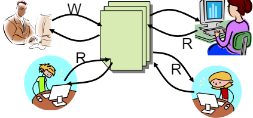
</p>

Consider a shared database with two classes of users. Writers read and modify database, and Readers only read, never modifies the database. We could make constraints for those users for correctness:
- Readers can access database when no writers
- Writers can access database when no readers or writers

Basic structure of a solution:
```
- Reader()
    Wait until no writers
    Access data base
    Check out – wake up a waiting writer

- Writer()
    Wait until no active readers or writers
    Access database
    Check out – wake up waiting readers or writer
```
- State variables (Protected by a lock called “lock”):
  - int AR: Number of active readers; initially = 0
  - int WR: Number of waiting readers; initially = 0
  - int AW: Number of active writers; initially = 0
  - int WW: Number of waiting writers; initially = 0
  - Condition okToRead = NIL
  - Condition okToWrite = NIL

### 3.2.1. Reader / Writer Solution

```c
Reader() {
    //// First check self into system
    acquire(&lock);
    while ((AW + WW) > 0) { // Is it safe to read?
        WR++; // No. Writers exist
        cond_wait(&okToRead,&lock);// Sleep on cond var
        WR--; // No longer waiting
    }
    AR++; // Now we are active!
    release(&lock);

    //// Perform actual read-only access
    AccessDatabase(ReadOnly);

    //// Now, check out of system
    acquire(&lock);
    AR--; // No longer active
    if (AR == 0 && WW > 0) // No other active readers
        cond_signal(&okToWrite);// Wake up one writer
    release(&lock);
}

Writer() {
    //// First check self into system
    acquire(&lock);
    while ((AW + AR) > 0) { // Is it safe to write?
        WW++; // No. Active users exist
        cond_wait(&okToWrite,&lock); // Sleep on cond var
        WW--; // No longer waiting
    }
    AW++; // Now we are active!
    release(&lock);

    //// Perform actual read/write access
    AccessDatabase(ReadWrite);

    //// Now, check out of system
    acquire(&lock);
    AW--; // No longer active
    if (WW > 0){ // Give priority to writers
        cond_signal(&okToWrite);// Wake up one writer
    } else if (WR > 0) { // Otherwise, wake reader
        cond_broadcast(&okToRead); // Wake all readers
    }
    release(&lock);
}
```

Consider these scenarios:

- R1, R2 are reading -> W1 arrives and waits -> R3 arrives and waits(since AW > 0)
- R1 reading -> W1, R2 arrives -> which one will get signal?

So, the monitor-based program can be generalized like:
```c
lock
while (need to wait) {
    condvar.wait();
}
unlock

do something so no need to wait

lock
condvar.signal();
unlock

```
